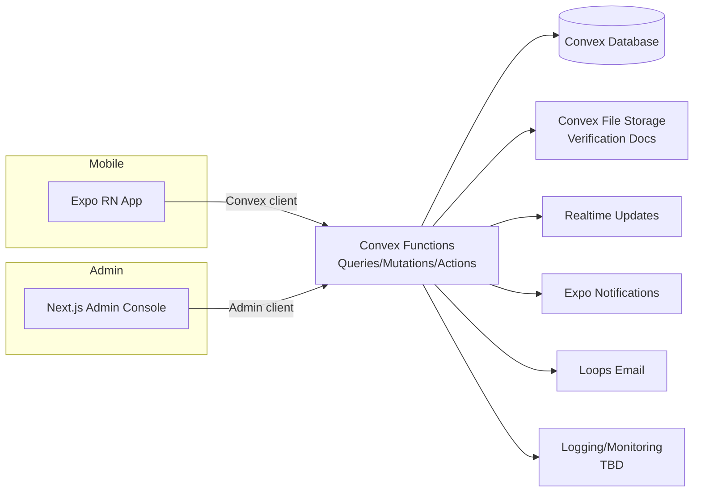
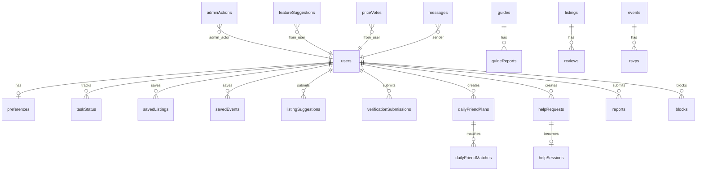

### Definitions/Glossary

|Term|Definition|
|---|---|
|ARC|Alien Registration Card; often tied to deadlines/renewals and checklists|
|Bilingual parity|EN/KR experiences feel equivalent; if translation is missing, show the other language with a visible “Translation pending / 번역 준비 중” badge|
|Daily Friend|Friendship-only same-day plan matching; not dating; not a social network; verification-gated|
|Help Me|Emergency translation request workflow: structured request → volunteer routing → session → rating + safety review|
|Verification|Identity verification used for safety controls; required for Daily Friend participation and Help Me volunteering|
|Coarse location|City/area-level only; never show exact user location publicly|
|Moderation queue|Admin workflow to review reports/content/verification/listing approvals; required for launch|
|Convex|Backend platform for database + server functions + realtime updates + file storage|
|PII|Personally identifiable information; includes verification docs, email, and sensitive profile content|
|RBAC|Role-based access control; permissions vary by role (user/verified/volunteer/admin)|
|Kill switch|Operator control to disable high-risk features (Daily Friend, Help Me) immediately|
|Trust scoring (internal)|Internal signal model using verified status + behavior + valid report history (not exposed publicly)|
|Browsing mode|User can explore without full onboarding; saving/RSVP/community actions prompt onboarding later|

---

## 1. Statement of Advisors (Governance)

### Advisory roles

- **Founder / Product Owner (Accountable):** Moses
    
- **Product Advisor (Consulted):** roadmap, prioritization, activation/retention loops
    
- **Safety & Trust Advisor (Block-right on launch of community features):** harassment/scam prevention, abuse controls, incident playbooks
    
- **Legal/Compliance Advisor (Consulted):** privacy/PII handling, Korea compliance review (statutes to confirm)
    
- **Security Advisor (Consulted):** RBAC, audit logging, file access controls, threat modeling
    
- **UX Lead (Responsible):** onboarding, IA, safety UX, bilingual UX parity and accessibility
    
- **Data/Analytics Advisor (Responsible/Consulted):** taxonomy, dashboards, privacy-safe analytics
    
- **Korea Life Domain Advisor (Consulted):** guide correctness, terminology, link quality
    

### Responsibilities + decision rights (RACI)

|Area|Responsible|Accountable|Consulted|Informed|
|---|---|---|---|---|
|Product scope & prioritization|Product/Founder|Founder|Advisors|Team|
|Safety controls & abuse prevention|Safety Advisor + Security|Founder|Legal, UX|Team|
|PII handling + verification program|Security + Product|Founder|Legal|Team|
|UX flows + bilingual parity|UX Lead|Founder|Accessibility/Data|Team|
|Guide content quality|Domain Advisor|Founder|UX/Product|Team|
|Analytics taxonomy + dashboards|Data Advisor|Founder|Security/Product|Team|
|Launch readiness sign-off|Product/Founder|Founder|Safety (block-right), Legal, Security, UX|Team|

### Review cadence + sign-off criteria

- **Weekly (Product):** onboarding drop-offs, First 7 Tasks completion progress, top support issues
    
- **Weekly (Safety Ops):** reports volume, time-to-action, kill switch readiness, verification backlog
    
- **Bi-weekly (Content):** guide freshness, broken links, “last reviewed” compliance
    
- **Release sign-off requires:**
    
    - Admin console queues working end-to-end (report → triage → action → audit log)
        
    - Verification doc storage access-controlled and audited
        
    - Kill switches tested in staging and production
        
    - “No dating / no open group chats” constraints enforced in UX + backend
        
    - Privacy defaults enforced (coarse location, generic notifications)
        

---

## 2. Vision & Strategy

### Vision statement

Make living in Korea less stressful for foreigners by turning confusion into clear steps and safe support.

### Mission

Provide a bilingual life hub for guides, checklists, discovery, events, and safety-first support features with strong moderation and privacy defaults.

### North-star metric

**% of new users who complete First 7 Tasks within 7 days**

### Strategy narrative (why now, differentiation)

- Foreign residents often rely on scattered sources (blogs/forums, group chats) that are stale, inconsistent, or risky.
    
- Girugi differentiates by:
    
    - **Structure over noise:** guides + checklists + next actions (not a feed)
        
    - **Foreigner-aware discovery:** dietary filters and practical tips
        
    - **Follow-through:** RSVP + reminders, task reminders
        
    - **Safe-by-default community:** verification gates + report/block + moderation + kill switches
        
    - **Bilingual parity:** users can proceed even when translations lag (clear badge)
        

### Product principles (10)

1. Safety-first by design (gates, defaults, auditability)
    
2. No dating (hard rule)
    
3. No open group chats (hard rule)
    
4. Structured workflows over social feeds
    
5. Bilingual parity with visible fallback
    
6. Coarse location only in public contexts
    
7. Momentum over overwhelm (First 7 Tasks feel doable)
    
8. Trustworthy steps (guide template + “last reviewed”)
    
9. Founder-operable operations (lean admin console, high leverage)
    
10. Fail safely (clear empty states, no risky silent failures)
    

### Non-goals / out of scope (explicit)

- Dating or romantic matching
    
- Open/public group chats
    
- Unmoderated public messaging
    
- Publishing exact user location or enabling location-based targeting
    
- Claiming to provide authoritative legal/medical advice (can provide practical guidance and referrals later)
    

---

## 3. Environment & Context

### Business context

- **Phase 1:** Free launch MVP focused on activation + core utility + safety baseline (including gated community features with controls)
    
- **Phase 2:** Optional Pro, teased in onboarding; includes offline packs, smart deadline reminders, legal routing, advanced filters, priority support
    

### User context & usage environments

- **Devices:** mobile-first (iOS/Android)
    
- **Connectivity:** intermittent/poor (subways, basements). App must degrade gracefully and support limited offline behaviors.
    
- **Accessibility:** bilingual users, varying fluency; dynamic type; large tap targets; careful EN/KR layout handling
    
- **Safety context:** scams/harassment risks in community interactions; privacy-first defaults
    

### Technical environment assumptions (constraints)

- **Backend:** Convex (DB + functions + realtime + file storage)
    
- **Mobile:** Expo React Native
    
- **Admin:** Next.js web app
    
- **Push notifications:** Expo Notifications
    
- **Email:** Loops (verification status + operational messages)
    
- **Subscriptions (Phase 2):** RevenueCat
    
- **Cloud provider:** _TBD (Convex-managed platform; any additional infra to confirm)_
    
- **Maps/geocoding provider:** _TBD_ (directory can function without live maps; addresses are listing data, not user location)
    

### Stakeholder map

- Founder/Product Owner (Moses)
    
- End users: new arrivals, students, working professionals, settled residents
    
- Verified users (Daily Friend participants)
    
- Volunteers (Help Me responders)
    
- Admins/moderators (initially founder)
    
- Advisors: safety, legal, security, UX/accessibility, data, domain
    

---

## 4. Regulations, Compliance, and Risk Factors

### Applicable regulations by region

- **Korea privacy + identity verification handling:** **to confirm with Legal/Compliance advisor**
    
- **Cross-border data access (admins outside Korea):** **to confirm**
    
- **GDPR/CCPA applicability:** **to confirm based on user geography and processing**
    

### Privacy & data handling requirements

- **Data minimization:** collect only what is necessary for features
    
- **PII categories:**
    
    - Email (required for OTP auth)
        
    - Verification documents (highly sensitive)
        
    - Optional sensitive preferences (dietary may be sensitive to some users)
        
    - Message/session content (potentially sensitive)
        
- **Verification documents:**
    
    - Stored in Convex file storage with strict access controls
        
    - Admin access logged (audit trail)
        
    - Retention policy: **TBD**
        
- **Public profile defaults:**
    
    - No phone number display
        
    - No exact location
        
    - Coarse city/area optional and non-precise
        
- **Notifications default generic:** avoid sensitive details by default; user can opt into more detail later
    
- **Analytics privacy:** never send message contents, verification doc metadata, or exact location
    

### Security posture (threat model summary)

**Primary threats**

- Scams/impersonation targeting foreigners
    
- Harassment/coercion via 1:1 chat
    
- Doxxing / attempts to reveal address/phone
    
- Abuse of Help Me to extract personal info
    
- Verification doc leakage (PII breach)
    
- Spam reviews/listings and manipulation of trust signals
    
- Weaponized reporting to silence others
    

**Key controls**

- Verification gates for Daily Friend and Help Me volunteering
    
- Report/block everywhere; server-side enforcement
    
- Admin moderation queues + audit logs
    
- Kill switches for Daily Friend and Help Me
    
- Rate limits (OTP, posting, reviews, reports, messaging bursts)
    
- Content filtering best-effort for phone/address patterns in public fields
    
- Generic notifications by default
    

### Risk register

|Risk|Likelihood|Impact|Mitigation|Owner|
|---|---|---|---|---|
|Verification doc exposure|Med|High|Least privilege, access logging, secure storage, retention policy|Security/Founder|
|Harassment in 1:1 chat|Med|High|No unsolicited messaging, block/report always visible, rate limits, post-session safety review|Safety/UX|
|Scams/impersonation|Med|High|Verification gates, trust signals, moderation queue, anomaly monitoring|Safety/Security|
|Outdated guides cause harm/confusion|High|Med|“Last reviewed,” editorial workflow, link checks, report inaccurate|Domain/Product|
|Help Me misuse (coercion/harassment)|Med|High|Verified volunteers, text-first, kill switch, session rating + safety flow|Safety|
|Volunteer coverage gaps|High|Med|Clear “no volunteers available” safe state, bounded volunteer tools, incentives|Product|
|Spam reviews/listings|Med|Med|Rate limits, approvals for suggestions, moderation actions|Admin|
|Translation gaps reduce trust|High|Med|Parity fallback badge, translation status tracking|UX/Product|
|Weaponized reporting|Med|Med|Rate limits + admin review rules + audit logs|Safety/Admin|
|Privacy incidents via notifications|Low/Med|High|Generic defaults + user-controlled detail setting|UX/Security|

### Ethical considerations / safety constraints

- Do not pressure users into community features
    
- Make safety rules visible: “No dating,” “No open group chats,” coarse location
    
- Avoid any UX that helps stalking or location targeting
    
- Keep emergency flows bounded: user consent, minimal disclosure, clear exit paths
    
- Build for “founder can operate safely” from day one
    

---

## 5. Core Product Overview

### Executive summary

Girugi is a bilingual EN/KR Korea-life hub for foreigners: it provides structured guides and checklists (anchored by First 7 Tasks), foreigner-aware discovery with dietary filters, events with RSVP and reminders, and safety-first support features (Daily Friend and Help Me) gated by verification and moderated operations.

### Problem statement + jobs-to-be-done

**Problem:** Foreigners in Korea face confusion, language friction, missed deadlines, discovery that isn’t foreigner-aware, and risky community support channels.

**JTBD**

- “Tell me what to do next, in the right order.”
    
- “Help me follow through on tasks and reminders.”
    
- “Help me find places that match my dietary needs.”
    
- “Help me attend events without missing details.”
    
- “Help me connect safely for a simple plan.”
    
- “Help me get translation support quickly when it matters.”
    

### Value proposition

A structured, bilingual support system for living in Korea that emphasizes clear steps and safety-first help, instead of chaotic social spaces.

### Key use cases

- New arrival completes First 7 Tasks within the first week
    
- User filters dietary-friendly places and saves favorites
    
- User RSVPs to events and receives reminders
    
- Verified users create/respond to Daily Friend plans and chat safely
    
- User creates Help Me request; verified volunteer supports via text
    

### Scope definition (in-scope vs out-of-scope)

**In-scope (Phase 1)**

- Email OTP auth
    
- Onboarding (Screens 1–9) including browsing mode behavior
    
- Home dashboard anchored by First 7 Tasks
    
- Guides + checklists + “last reviewed”
    
- Discover directory + dietary filters + reviews + suggest listing (approval queue)
    
- Events + RSVP + reminders + saved events
    
- Daily Friend (verification-gated) with restricted 1:1 chat
    
- Help Me (text-first) request + routing + volunteer flow (verification-gated)
    
- Safety ops: block/report everywhere, admin console queues, audit logs, kill switches
    
- Analytics: onboarding funnel, activation/retention signals, safety metrics
    

**Out-of-scope**

- Dating, romantic matching
    
- Open group chats
    
- Unmoderated public messaging
    
- Voice/video Help Me in Phase 1 (feature-flagged later)
    
- Final Pro pricing/package details (Phase 2)
    

### Dependencies (internal/external)

- **Internal**
    
    - Content ops for guides (editorial workflow + review cadence)
        
    - Moderation operations capacity (founder/admin initially)
        
- **External**
    
    - Expo Notifications (push)
        
    - Loops (email)
        
    - RevenueCat (Phase 2)
        
    - Verification doc policy (accepted doc types, rejection reasons) to be finalized
        
    - Volunteer coverage strategy for Help Me (availability/incentives)
        

---

## 6. Target Market & User Analysis

### Audience segmentation (B2C)

- **New arrivals (0–3 months):** need order, checklists, reassurance
    
- **Settled residents (3+ months):** need discovery/events, occasional safe support
    
- **Students:** cost-aware guidance, study-friendly meetups
    
- **Working professionals:** quick answers, reminders, efficient planning
    
- **Volunteers:** bounded, safe way to help without exposure
    

### User personas (6)

1. **New Arrival Nadia**
    

- Goals: complete essential setup, avoid mistakes
    
- Pains: doesn’t know what matters first; language anxiety
    
- Triggers: visa/ARC steps, banking, hospital visit
    
- Objections: “Is this trustworthy?” “Will this expose me?”
    
- Accessibility: simple language, clear steps, bilingual fallback
    

2. **Student Sam**
    

- Goals: find budget-friendly places/events, safe community
    
- Pains: info scattered; KR-heavy posts
    
- Triggers: semester start, club fairs, visa paperwork
    
- Objections: “Is this spammy?” “Will people be weird?”
    
- Accessibility: digestible lists, saved items, reminders
    

3. **Working Pro Priya**
    

- Goals: solve problems fast; plan weekends
    
- Pains: time scarcity; doesn’t want long onboarding
    
- Triggers: weekends, holidays, last-minute needs
    
- Objections: “I won’t fill a long setup”
    
- Accessibility: fast paths, skip options, clear “next action”
    

4. **Settled Resident Rafael**
    

- Goals: discover new places; attend events; help others
    
- Pains: tired of noisy group chats
    
- Triggers: new neighborhood, new dietary preference
    
- Objections: “Is the community safe and clean?”
    
- Accessibility: clear boundaries and controls
    

5. **Volunteer Vina**
    

- Goals: help with translation safely
    
- Pains: harassment risk; exposure risk; time bounded
    
- Triggers: availability windows
    
- Objections: “Will my identity be protected?”
    
- Accessibility: quick accept/decline; safe defaults; simple tools
    

6. **Admin/Operator Moses**
    

- Goals: keep users safe with limited time
    
- Pains: moderation overload; verification backlog
    
- Triggers: spikes in reports; suspicious activity
    
- Objections: “If ops is heavy, we can’t scale”
    
- Accessibility: efficient queues, bulk actions, audit logs, kill switches
    

### User journey narrative (before/during/after)

- **Before:** user searches blogs/forums; asks in group chats; gets conflicting advice and risk exposure
    
- **During:** user uses Girugi to complete First 7 Tasks, find places/events, and use gated support when needed
    
- **After:** user returns for events/discovery; trusts Girugi as a stable hub; uses community tools occasionally and safely
    

### Competitive analysis

|Competitor / Alternative|Strengths|Weaknesses|Girugi differentiation|
|---|---|---|---|
|Blogs/forums|Lots of info|Stale, inconsistent, hard to follow|Structured guides + checklists + “last reviewed”|
|Group chats|Fast replies|Noisy, risky, scams/harassment|Verification gates + bounded 1:1 + moderation|
|Maps/listing apps|Broad coverage|Not foreigner-aware|Dietary-aware discovery + tips + trust controls|
|Event listing sites|Many events|Fragmented; often KR-heavy|City/interest personalization + RSVP + reminders|

### Positioning statement

Girugi is the bilingual Korea-life hub that turns messy life tasks into clear steps and makes support safer by design, without becoming a chaotic social network.

---

## 7. User Stories & Requirements

### 7.1 Epics

|Epic ID|Name|Outcome|Priority|
|---|---|---|---|
|EP-001|Auth + Sessions|Users sign in reliably with OTP|P0|
|EP-002|Onboarding + Preferences|Users reach “Plan Ready” quickly; preferences saved|P0|
|EP-003|Home + First 7 Tasks|Users always see next best action|P0|
|EP-004|Guides + Checklists|Trustworthy steps + stateful progress|P0|
|EP-005|Discover Directory|Find places with dietary filters + saving|P0|
|EP-006|Reviews + Moderation|Collect feedback without abuse|P0|
|EP-007|Events + RSVP + Reminders|Event discovery + follow-through|P0|
|EP-008|Verification|Gate high-risk actions; reduce scams|P0|
|EP-009|Daily Friend|Safe same-day plans + restricted chat|P1 (gated rollout)|
|EP-010|Help Me|Text-first emergency translation support|P1 (gated rollout)|
|EP-011|Safety Ops + Admin Console|Queues + actions + kill switches + audit logs|P0|
|EP-012|Analytics|Funnel + safety metrics baseline|P0|
|EP-013|Pro Monetization|Phase 2 entitlements + billing|P2|

### 7.2 User stories

|US-ID|Persona|Story|Priority|Dependencies|
|---|---|---|---|---|
|US-001|New Arrival|I want First 7 Tasks so I stop guessing what’s next|P0|EP-003/004|
|US-002|Any|I want bilingual parity so missing translations don’t block me|P0|EP-002/004|
|US-003|Dietary user|I want dietary filters everywhere so I can trust discovery|P0|EP-005|
|US-004|Any|I want event reminders so I don’t miss details|P0|EP-007|
|US-005|Cautious user|I want verification-gated community features to reduce scams|P0|EP-008/011|
|US-006|Any|I want to block/report anywhere so I feel safe|P0|EP-011|
|US-007|Verified user|I want friendship-only plans with coarse location so it feels safe|P1|EP-009/008/011|
|US-008|User|I want structured emergency translation help with a safe fallback|P1|EP-010/011|
|US-009|Volunteer|I want to accept/decline safely and not be exposed|P1|EP-010/008/011|
|US-010|Admin|I want queues + audit logs so I can operate safely|P0|EP-011|

### 7.3 Functional requirements (FR-###)

> Notes: Each FR includes user value → acceptance criteria → analytics → edge cases → security/privacy.

#### FR-001 Email OTP sign-in

- **Description:** Email-based OTP sign-in with resend cooldown, attempt limits, and clear errors.
    
- **Rationale/user value:** Low-friction access while reducing OTP abuse.
    
- **Acceptance criteria (G/W/T):**
    
    - Given a valid email, when user requests OTP, then OTP is sent and UI shows cooldown.
        
    - Given too many requests, when requesting again, then show lockout state until timer ends.
        
    - Given wrong OTP, when submitted, then show error and increment attempt count.
        
- **Edge cases & error states:** invalid email format; delivery delay; offline; repeated wrong codes.
    
- **Analytics events:** auth_otp_requested, auth_otp_verified, auth_otp_failed, auth_rate_limited.
    
- **Security/privacy notes:** Do not reveal whether an email exists; rate limit by email + device; minimal auth logs.
    

#### FR-002 Session persistence

- **Description:** Maintain authenticated session across app restarts; handle expiration.
    
- **Rationale/user value:** Users don’t re-auth constantly.
    
- **Acceptance criteria:**
    
    - Given a signed-in user, when reopening app, then user lands on Home without re-login if session valid.
        
    - Given expired session, when opening app, then user is redirected to login with explanation.
        
- **Edge cases:** clock drift; offline startup.
    
- **Analytics:** session_restored, session_expired.
    
- **Security/privacy:** secure token storage per platform; revoke on suspicious activity (admin action).
    

#### FR-010 Browsing mode (limited access)

- **Description:** “I’m just browsing” allows exploration; saving/RSVP/community actions prompt onboarding later.
    
- **Rationale/user value:** Low-pressure entry; still drives eventual activation.
    
- **Acceptance criteria:**
    
    - Given browsing user, when opening modules, then content is viewable with defaults.
        
    - Given browsing user, when attempting save/RSVP/review/community, then prompt onboarding to enable.
        
- **Edge cases:** user partially completes onboarding; tries repeatedly.
    
- **Analytics:** browse_mode_selected, browse_gate_shown, browse_to_onboarding_started.
    
- **Security/privacy:** browsing collects minimal data; no public profile exposure.
    

#### FR-020 Onboarding screens 1–9 (copy + behavior)

- **Description:** Implement onboarding steps exactly as defined (Screens 1–9) including Plan Ready and Screen 9 research inputs.
    
- **Rationale/user value:** Fast time-to-value + personalization.
    
- **Acceptance criteria:**
    
    - Given new user, when completing each step, then preferences persist.
        
    - Given skipping optional steps, when landing on Home, then Home renders with sensible defaults.
        
    - Given language selected, when content missing translation, then fallback shows with badge.
        
- **Edge cases:** app closed mid-onboarding; language switch mid-step; offline saves.
    
- **Analytics:** onboarding_started, onboarding_step_viewed, onboarding_step_completed, onboarding_skipped_step, onboarding_completed.
    
- **Security/privacy:** city not public by default; dietary optional; no sensitive text in analytics payloads.
    

#### FR-021 Bilingual parity fallback badge

- **Description:** If EN/KR translation missing, show available content with “Translation pending / 번역 준비 중”.
    
- **Rationale/user value:** Users aren’t blocked by missing translations.
    
- **Acceptance criteria:**
    
    - Given KR selected and KR content missing, when viewing entity, then show EN with badge.
        
    - Given EN selected and EN content missing, when viewing entity, then show KR with badge.
        
- **Edge cases:** mixed-language UI; search indexing by language.
    
- **Analytics:** i18n_fallback_shown (entity_type, entity_id).
    
- **Security/privacy:** avoid logging user-entered sensitive text.
    

#### FR-030 Preferences storage and edits

- **Description:** Store language, city, situation, dietary[], interests[], notifPrefs; editable in Settings.
    
- **Rationale/user value:** Personalization stays accurate.
    
- **Acceptance criteria:**
    
    - Given user updates preferences, when saved, then modules reflect updates.
        
- **Edge cases:** “No restrictions” clears dietary; city unset prompts gentle re-prompt.
    
- **Analytics:** preferences_saved, city_changed, dietary_updated, interests_updated.
    
- **Security/privacy:** dietary treated as potentially sensitive; not public by default.
    

#### FR-040 Home dashboard composition

- **Description:** Home shows First 7 Tasks (always visible), best guide, top picks, events this week with fallbacks.
    
- **Rationale/user value:** Clear next action and quick wins.
    
- **Acceptance criteria:**
    
    - Given tasks incomplete, when Home loads, then show progress + “Next task” CTA.
        
    - Given city missing, then show generic feed and prompt city selection.
        
- **Edge cases:** no content available; offline cached content.
    
- **Analytics:** home_opened, first7_viewed, next_task_clicked, home_city_prompt_shown.
    
- **Security/privacy:** no sensitive content in notification previews.
    

#### FR-050 First 7 Tasks definitions and delivery

- **Description:** Provide a curated First 7 Tasks list with short, high-confidence items.
    
- **Rationale/user value:** Momentum quickly.
    
- **Acceptance criteria:**
    
    - Given new user, when Plan Ready, then First 7 Tasks starts at 0/7.
        
    - Given task complete, then progress updates immediately.
        
- **Edge cases:** task list updates; user resets tasks (admin tool, if needed).
    
- **Analytics:** first7_task_started, first7_task_completed, first7_completed.
    
- **Security/privacy:** task notes treated as private; avoid analytics payload containing notes.
    

#### FR-051 Checklist item state model

- **Description:** Checklist items support state (not started/in progress/done), timestamp, optional notes.
    
- **Rationale/user value:** Real progress tracking, not just reading.
    
- **Acceptance criteria:**
    
    - Given a checklist item, when state changes, then persist and sync across devices.
        
- **Edge cases:** offline state changes queued; conflicts resolved last-write-wins with timestamps.
    
- **Analytics:** checklist_item_state_changed.
    
- **Security/privacy:** notes can contain sensitive info; do not send to analytics.
    

#### FR-060 Guides template + last reviewed

- **Description:** Guides have structure: overview, what you need, steps, common mistakes, links, glossary, lastReviewedAt.
    
- **Rationale/user value:** Trust and predictability.
    
- **Acceptance criteria:**
    
    - Given guide view, when loaded, then required sections appear or show “Not available yet”.
        
    - Given admin updates guide, then lastReviewedAt updates.
        
- **Edge cases:** broken links; missing translations.
    
- **Analytics:** guide_opened, guide_link_clicked, guide_report_inaccurate.
    
- **Security/privacy:** guides must not request user PII.
    

#### FR-070 Global search v0

- **Description:** Search across guides, listings, and events from entry points in hubs.
    
- **Rationale/user value:** Find answers quickly.
    
- **Acceptance criteria:**
    
    - Given a query, when submitted, then results show grouped by entity type with top matches first.
        
- **Edge cases:** no results; language mismatch; offline search limited to cached.
    
- **Analytics:** search_performed (scope, query_length, results_count).
    
- **Security/privacy:** do not log raw query text if it may contain sensitive info; store only length + hashed tokenization if needed (TBD).
    

#### FR-080 Discover directory browse/search

- **Description:** Browse/search listings by city + category + keyword; empty states prompt “set city”.
    
- **Rationale/user value:** Relevant discovery quickly.
    
- **Acceptance criteria:**
    
    - Given city set, when selecting category, then results update.
        
    - Given no city, when opening Discover, then show generic featured + prompt city.
        
- **Edge cases:** no results; slow network.
    
- **Analytics:** discover_opened, category_selected, listing_search_performed.
    
- **Security/privacy:** listing addresses are public business info; avoid tying them to user presence.
    

#### FR-081 Dietary filters apply everywhere

- **Description:** Dietary filters apply consistently across listing feeds, details, and review surfaces.
    
- **Rationale/user value:** Trust in discovery.
    
- **Acceptance criteria:**
    
    - Given dietary preferences, when browsing, then filter chips reflect it and results respect it.
        
- **Edge cases:** missing dietary metadata; conflicting tags.
    
- **Analytics:** dietary_filter_used.
    
- **Security/privacy:** dietary is optional; not public by default.
    

#### FR-082 Save/bookmark places

- **Description:** Users can bookmark listings.
    
- **Rationale/user value:** Build personal shortlist.
    
- **Acceptance criteria:** bookmark toggles persist; show in Saved.
    
- **Edge cases:** offline toggle queued.
    
- **Analytics:** listing_saved, listing_unsaved.
    
- **Security/privacy:** saved items are private.
    

#### FR-090 Suggest a listing (approval queue)

- **Description:** Users submit listing suggestions; admin approves before public.
    
- **Rationale/user value:** Directory improves without spam.
    
- **Acceptance criteria:** submission status pending; visible in admin queue; approve publishes.
    
- **Edge cases:** duplicates; malicious links.
    
- **Analytics:** listing_suggested, listing_suggestion_approved, listing_suggestion_rejected.
    
- **Security/privacy:** submitter hidden publicly; rate limit submissions.
    

#### FR-100 Reviews create/edit/report

- **Description:** Rating + short text + optional tags; edit allowed; reportable; moderation status.
    
- **Rationale/user value:** Trust signals.
    
- **Acceptance criteria:** post review appears unless held; admin can hide/remove.
    
- **Edge cases:** abuse text; brigading.
    
- **Analytics:** review_submitted, review_edited, review_reported.
    
- **Security/privacy:** profanity/PII filters best-effort; rate limits.
    

#### FR-110 Events feed and detail (bilingual)

- **Description:** Events feed personalized by city + interests; supports bilingual fields.
    
- **Rationale/user value:** Find relevant things to do.
    
- **Acceptance criteria:** if interests missing, still show city-based feed.
    
- **Edge cases:** canceled events; missing details.
    
- **Analytics:** events_opened, event_opened.
    
- **Security/privacy:** do not show attendee lists publicly by default.
    

#### FR-111 RSVP states + saved events

- **Description:** RSVP Yes/Maybe/No; saved to profile; used for reminders and Home modules.
    
- **Rationale/user value:** Follow-through.
    
- **Acceptance criteria:** RSVP persists; appears in “My RSVPs”.
    
- **Edge cases:** event time changes; user changes RSVP.
    
- **Analytics:** rsvp_set, event_saved, event_unsaved.
    
- **Security/privacy:** notifications generic by default.
    

#### FR-112 Reminder scheduling (push + in-app)

- **Description:** Reminders for tasks and events using Expo Notifications; fallback to in-app reminders if denied.
    
- **Rationale/user value:** Reduce missed deadlines and events.
    
- **Acceptance criteria:** if push enabled, schedule; if denied, show in-app reminders and Settings path.
    
- **Edge cases:** timezone changes; OS restrictions.
    
- **Analytics:** reminder_set, reminder_fired, reminder_delivery_failed.
    
- **Security/privacy:** generic content by default.
    

#### FR-120 Verification submission + review

- **Description:** Users upload verification doc; status pending → verified or rejected with reason category; resubmission allowed.
    
- **Rationale/user value:** Safer community features.
    
- **Acceptance criteria:** status updates visible; rejection shows reason category; resubmit enabled.
    
- **Edge cases:** unreadable image; wrong doc; duplicates.
    
- **Analytics:** verification_started, verification_submitted, verification_approved, verification_rejected, verification_resubmitted.
    
- **Security/privacy:** docs accessible only to admin role; every access logged.
    

#### FR-130 Daily Friend gating + preview

- **Description:** Unverified users see limited preview; must verify to post/respond/chat.
    
- **Rationale/user value:** Reduces scams/harassment.
    
- **Acceptance criteria:** gate shown on action; verified users can proceed.
    
- **Edge cases:** user loses verified status (admin action).
    
- **Analytics:** daily_friend_gate_shown.
    
- **Security/privacy:** coarse location enforced; report/block available.
    

#### FR-131 Daily Friend plan creation

- **Description:** Create plan: activity, time window, coarse area, short description; safety reminder visible.
    
- **Rationale/user value:** Low-pressure social support.
    
- **Acceptance criteria:** plan visible to eligible users; accept/decline flow supported.
    
- **Edge cases:** attempts to share exact address/phone; spam plans.
    
- **Analytics:** daily_friend_plan_created, daily_friend_plan_viewed.
    
- **Security/privacy:** content filters + rate limits.
    

#### FR-132 Daily Friend matching and restricted 1:1 chat

- **Description:** 1:1 chat only after accept; no unsolicited messaging.
    
- **Rationale/user value:** Reduces harassment.
    
- **Acceptance criteria:** without match, messaging denied with explanation.
    
- **Edge cases:** harassment; off-platform coercion.
    
- **Analytics:** daily_friend_match_created, message_sent, chat_block_used, chat_report_submitted.
    
- **Security/privacy:** chat content treated as sensitive; retention policy TBD.
    

#### FR-133 Post-meet feedback (private)

- **Description:** After plan completion, collect lightweight private trust input.
    
- **Rationale/user value:** Improves safety signals over time.
    
- **Acceptance criteria:** feedback saved privately; not shown publicly.
    
- **Edge cases:** retaliatory feedback; false claims.
    
- **Analytics:** daily_friend_feedback_submitted.
    
- **Security/privacy:** treat as sensitive; admin access logged.
    

#### FR-140 Help Me request creation

- **Description:** Create request with category, language direction, urgency, optional notes; user consent for any sensitive info sharing.
    
- **Rationale/user value:** Structured help fast.
    
- **Acceptance criteria:** request created; status updates visible.
    
- **Edge cases:** user enters highly sensitive info; abusive requests.
    
- **Analytics:** help_request_created.
    
- **Security/privacy:** minimize info; do not expose identity beyond necessity.
    

#### FR-141 Help Me routing + “no volunteers” safe fail

- **Description:** Route to online verified volunteers first; fallback when none available.
    
- **Rationale/user value:** Predictable behavior in emergencies.
    
- **Acceptance criteria:** if none available, show “No volunteers available right now” with next steps.
    
- **Edge cases:** volunteer disappears mid-flow.
    
- **Analytics:** help_request_routed, help_no_volunteers, help_request_expired.
    
- **Security/privacy:** avoid exposing requester details broadly.
    

#### FR-142 Help Me session (text-first)

- **Description:** Text chat session; report/block always available; end session triggers rating and safety review.
    
- **Rationale/user value:** Safe and bounded support.
    
- **Acceptance criteria:** either party can end; rating shown; completion confirmation required for volunteer points.
    
- **Edge cases:** harassment; wrong language direction.
    
- **Analytics:** help_request_accepted, help_session_started, help_session_completed, help_session_rated, help_report_submitted.
    
- **Security/privacy:** message content not in analytics.
    

#### FR-150 Block user (global)

- **Description:** One-tap block; immediate effect; no notification to blocked user.
    
- **Rationale/user value:** Personal safety control.
    
- **Acceptance criteria:** block closes chat, hides profile/plans, prevents future matching.
    
- **Edge cases:** mutual blocks; existing sessions.
    
- **Analytics:** block_used (context).
    
- **Security/privacy:** enforce server-side; avoid leaking block state.
    

#### FR-151 Report content/user (global)

- **Description:** Report from profile/chat/review/listing/event/help session with reason + notes.
    
- **Rationale/user value:** Platform safety.
    
- **Acceptance criteria:** report enters admin queue with context snapshot.
    
- **Edge cases:** offline report queued; duplicate reports.
    
- **Analytics:** report_submitted.
    
- **Security/privacy:** store minimal context; protect reporter identity from reported user.
    

#### FR-160 Admin console queues

- **Description:** Admin queues: verification, reports, listing approvals; include actions and required reason field.
    
- **Rationale/user value:** Founder can operate safely.
    
- **Acceptance criteria:** each item shows context; actions create audit log entry.
    
- **Edge cases:** concurrent admin actions.
    
- **Analytics:** admin_queue_opened, admin_action_taken.
    
- **Security/privacy:** strong admin auth; least privilege.
    

#### FR-161 Audit logs (append-only)

- **Description:** Every admin action stored with timestamp, adminId, target, reason, metadata.
    
- **Rationale/user value:** Accountability and incident response.
    
- **Acceptance criteria:** any admin mutation writes audit log record.
    
- **Edge cases:** partial failures; timezone normalization.
    
- **Analytics:** audit_log_written (internal).
    
- **Security/privacy:** protect from tampering; limit sensitive metadata.
    

#### FR-162 Kill switches

- **Description:** Admin can disable Daily Friend and/or Help Me immediately.
    
- **Rationale/user value:** Rapid containment of abuse.
    
- **Acceptance criteria:** when disabled, users see clear disabled state; backend blocks actions.
    
- **Edge cases:** active sessions at time of disable (show safe shutdown behavior).
    
- **Analytics:** kill_switch_toggled.
    
- **Security/privacy:** admin-only; audited.
    

#### FR-170 Feature suggestions (Screen 9)

- **Description:** Collect one free-text feature wish, stored privately with segment snapshot.
    
- **Rationale/user value:** Inform roadmap.
    
- **Acceptance criteria:** submission stored; user sees confirmation.
    
- **Edge cases:** abusive text; PII in suggestion.
    
- **Analytics:** feature_suggestion_submitted.
    
- **Security/privacy:** store privately; content filtering best-effort.
    

#### FR-171 Price vote (Screen 9)

- **Description:** Collect price preference ($1/$5/$8/$12/more), with “free now” reassurance.
    
- **Rationale/user value:** Pricing research.
    
- **Acceptance criteria:** vote stored; custom value stored if provided.
    
- **Edge cases:** currency confusion; user skips.
    
- **Analytics:** price_vote_submitted.
    
- **Security/privacy:** private; avoid tying publicly to user identity.
    

### 7.4 Non-functional requirements (NFR-###)

> Any numeric targets that aren’t provided are listed as **TBD** (to avoid invented numbers).

#### NFR-001 Performance (mobile)

- Home loads with skeleton states quickly; prioritize First 7 Tasks module.
    
- Feeds (discover/events) support pagination and incremental rendering.
    
- Chat: message send acknowledges quickly; retries on failures.
    
- **Quality targets:** latency budgets **TBD** per screen; crash-free rate **TBD**.
    

#### NFR-002 Reliability & availability

- Safe degradation when offline (cached views where available; queue writes).
    
- Help Me must fail safely with “no volunteers available” state.
    
- **Uptime/SLOs:** **TBD**.
    

#### NFR-003 Security baseline

- Server-side enforcement of RBAC and gating rules.
    
- Verification docs access-controlled and audited.
    
- Rate limiting and anomaly flags for abuse.
    

#### NFR-004 Privacy

- Coarse location only publicly.
    
- Generic notifications by default.
    
- Minimal analytics payload; no message text, no verification doc metadata.
    

#### NFR-005 Accessibility (WCAG alignment)

- Mobile: dynamic type; large tap targets; readable contrast.
    
- Admin web: keyboard navigable, focus states, semantic markup.
    
- WCAG level target: **TBD** (recommend confirming with UX/accessibility advisor).
    

#### NFR-006 Localization / i18n

- UI strings localized EN/KR.
    
- Content translation can lag; parity fallback badge required.
    
- Ensure layout handles longer KR strings.
    

#### NFR-007 Observability

- Structured logs for auth, verification, reports, routing, moderation actions.
    
- Alerts for spikes in reports, verification access anomalies, Help Me failures.
    
- Monitoring stack specifics: **TBD**.
    

#### NFR-008 Data retention, backup, disaster recovery

- Retention policy for verification docs, messages, reports: **TBD**
    
- Backup strategy depends on Convex capabilities + any external storage usage: **TBD**
    
- RPO/RTO: **TBD**
    

---

## 8. Detailed User Flows

### End-to-end flow map (Mermaid)

```mermaid
graph TD

    Start[User Opens App] --> CheckAuth{Authenticated?}

    CheckAuth -->|No| EmailEntry[Enter Email]

    EmailEntry --> RequestOTP[Request OTP]

    RequestOTP --> RateLimit{Rate Limited?}

    RateLimit -->|Yes| ShowCooldown[Show Cooldown Message]

    ShowCooldown --> EmailEntry

    RateLimit -->|No| SendOTP[Send OTP Code]

    SendOTP --> EnterOTP[Enter OTP Code]

    EnterOTP --> VerifyOTP{OTP Valid?}

    VerifyOTP -->|No| WrongOTP[Show Error]

    WrongOTP --> CheckAttempts{Max Attempts?}

    CheckAttempts -->|Yes| Lockout[Show Lockout]

    Lockout --> EmailEntry

    CheckAttempts -->|No| EnterOTP

    VerifyOTP -->|Yes| CreateSession[Create Session]

    CreateSession --> CheckOnboarding{Onboarding Complete?}

    CheckAuth -->|Yes| CheckOnboarding

    CheckOnboarding -->|No| Onboard1[Screen 1: Welcome]

    Onboard1 --> Onboard2[Screen 2: Language]

    Onboard2 --> Onboard3[Screen 3: City]

    Onboard3 --> Onboard4[Screen 4: Situation]

    Onboard4 --> Onboard5[Screen 5: Dietary]

    Onboard5 --> Onboard6[Screen 6: Interests]

    Onboard6 --> Onboard7[Screen 7: Notifications]

    Onboard7 --> Onboard8[Screen 8: Plan Ready]

    Onboard8 --> Onboard9[Screen 9: Verification/Pro]

    Onboard9 --> SavePreferences[Save User Preferences]

    SavePreferences --> Home

    CheckOnboarding -->|Yes| Home[Home Dashboard]

    Home --> First7Tasks[First 7 Tasks Module]

    Home --> Guides[Guides Hub]

    Home --> Discover[Discover Directory]

    Home --> Events[Events Hub]

    Home --> Community[Community Hub]

    Home --> HelpMe[Help Me CTA]

    Home --> Settings[Settings/Profile]

    First7Tasks --> TaskDetail[Open Task Detail]

    TaskDetail --> MarkDone[Mark Task Complete]

    MarkDone --> UpdateProgress[Update Progress]

    UpdateProgress --> CheckComplete{All 7 Done?}

    CheckComplete -->|No| First7Tasks

    CheckComplete -->|Yes| ShowCompletion[Show Completion State]

    ShowCompletion --> Home

    Guides --> GuideList[Browse Guide Categories]

    GuideList --> GuideDetail[View Guide Detail]

    GuideDetail --> ViewChecklist[View Related Checklist]

    ViewChecklist --> ChecklistItem[Checklist Item]

    ChecklistItem --> SetReminder[Set Reminder]

    SetReminder --> GuideDetail

    ChecklistItem --> MarkItemDone[Mark Item Done]

    MarkItemDone --> GuideDetail

    GuideDetail --> ReportGuide[Report Inaccurate]

    ReportGuide --> ReportFlow

    Discover --> SearchListings[Search/Browse Listings]

    SearchListings --> ApplyFilters[Apply Dietary Filters]

    ApplyFilters --> ListingResults[View Results]

    ListingResults --> ListingDetail[View Listing Detail]

    ListingDetail --> SaveListing[Save Listing]

    SaveListing --> ListingDetail

    ListingDetail --> WriteReview[Write Review]

    WriteReview --> CheckReviewLimit{Rate Limited?}

    CheckReviewLimit -->|Yes| ShowReviewLimit[Show Limit Message]

    ShowReviewLimit --> ListingDetail

    CheckReviewLimit -->|No| SubmitReview[Submit Review]

    SubmitReview --> ListingDetail

    ListingDetail --> ReportListing[Report Listing]

    ReportListing --> ReportFlow

    Discover --> SuggestPlace[Suggest a Place]

    SuggestPlace --> CheckSuggestLimit{Rate Limited?}

    CheckSuggestLimit -->|Yes| ShowSuggestLimit[Show Limit Message]

    ShowSuggestLimit --> Discover

    CheckSuggestLimit -->|No| SubmitSuggestion[Submit for Approval]

    SubmitSuggestion --> PendingQueue[Admin Approval Queue]

    PendingQueue --> Discover

    Events --> EventsFeed[Browse Events Feed]

    EventsFeed --> FilterEvents[Filter by City/Interests]

    FilterEvents --> EventDetail[View Event Detail]

    EventDetail --> SetRSVP[Set RSVP Status]

    SetRSVP --> EventReminder[Enable Event Reminder]

    EventReminder --> EventDetail

    EventDetail --> SaveEvent[Save Event]

    SaveEvent --> EventDetail

    EventDetail --> ReportEvent[Report Event]

    ReportEvent --> ReportFlow

    Community --> CheckVerified{Verified User?}

    CheckVerified -->|No| ShowVerificationGate[Show Verification Gate]

    ShowVerificationGate --> VerificationFlow

    CheckVerified -->|Yes| DailyFriend[Daily Friend]

    DailyFriend --> CreatePlan[Create Friendship Plan]

    CreatePlan --> CheckPlanLimit{Rate Limited?}

    CheckPlanLimit -->|Yes| ShowPlanLimit[Show Limit Message]

    ShowPlanLimit --> DailyFriend

    CheckPlanLimit -->|No| SubmitPlan[Submit Plan]

    SubmitPlan --> PlanActive[Plan Active]

    PlanActive --> DailyFriend

    DailyFriend --> BrowsePlans[Browse Plans]

    BrowsePlans --> RespondPlan[Respond to Plan]

    RespondPlan --> CreateMatch[Create Match]

    CreateMatch --> Chat1to1[1:1 Chat]

    Chat1to1 --> SendMessage[Send Message]

    SendMessage --> CheckChatLimit{Rate Limited?}

    CheckChatLimit -->|Yes| ShowChatLimit[Show Limit Message]

    ShowChatLimit --> Chat1to1

    CheckChatLimit -->|No| MessageSent[Message Sent]

    MessageSent --> Chat1to1

    Chat1to1 --> BlockUser[Block User]

    BlockUser --> BlockFlow

    Chat1to1 --> ReportUser[Report User]

    ReportUser --> ReportFlow

    Chat1to1 --> EndChat[End Chat]

    EndChat --> FeedbackPrompt[Feedback Prompt]

    FeedbackPrompt --> DailyFriend

    HelpMe --> CreateHelpRequest[Create Translation Request]

    CreateHelpRequest --> SelectCategory[Select Category]

    SelectCategory --> SetDirection[Set Language Direction]

    SetDirection --> AddNotes[Add Optional Notes]

    AddNotes --> ConsentEmergency[Consent for Emergency Info]

    ConsentEmergency --> SubmitRequest[Submit Help Request]

    SubmitRequest --> RouteRequest[Route to Volunteers]

    RouteRequest --> CheckVolunteers{Volunteers Available?}

    CheckVolunteers -->|No| NoVolunteers[Show No Volunteers Message]

    NoVolunteers --> HelpMe

    CheckVolunteers -->|Yes| VolunteerAccepts[Volunteer Accepts]

    VolunteerAccepts --> HelpSession[Help Me Session]

    HelpSession --> TextChat[Text Chat]

    TextChat --> SessionBlock[Block in Session]

    SessionBlock --> BlockFlow

    TextChat --> SessionReport[Report in Session]

    SessionReport --> ReportFlow

    TextChat --> EndSession[End Session]

    EndSession --> RateSession[Rate Session]

    RateSession --> SafetyReview[Safety Review Prompt]

    SafetyReview --> HelpMe

    VerificationFlow[Verification Flow] --> UploadDoc[Upload Verification Document]

    UploadDoc --> CheckFileValid{File Valid?}

    CheckFileValid -->|No| ShowFileError[Show File Error]

    ShowFileError --> UploadDoc

    CheckFileValid -->|Yes| SubmitVerification[Submit for Review]

    SubmitVerification --> VerificationPending[Status: Pending]

    VerificationPending --> AdminReview[Admin Reviews]

    AdminReview --> AdminDecision{Approve or Reject?}

    AdminDecision -->|Approve| VerificationApproved[Status: Verified]

    VerificationApproved --> UnlockFeatures[Unlock Community Features]

    UnlockFeatures --> Home

    AdminDecision -->|Reject| VerificationRejected[Status: Rejected]

    VerificationRejected --> ShowReason[Show Rejection Reason]

    ShowReason --> AllowResubmit[Allow Resubmission]

    AllowResubmit --> UploadDoc

    Settings --> ChangeLanguage[Change Language]

    ChangeLanguage --> UpdateUI[Update UI Language]

    UpdateUI --> Settings

    Settings --> ChangeCity[Change City]

    ChangeCity --> UpdateCity[Update City Preference]

    UpdateCity --> Settings

    Settings --> ChangeDietary[Change Dietary Filters]

    ChangeDietary --> UpdateDietary[Update Dietary Preferences]

    UpdateDietary --> Settings

    Settings --> ChangeInterests[Change Interests]

    ChangeInterests --> UpdateInterests[Update Interests]

    UpdateInterests --> Settings

    Settings --> NotificationSettings[Notification Settings]

    NotificationSettings --> UpdateNotifications[Update Notification Preferences]

    UpdateNotifications --> Settings

    Settings --> ViewVerification[View Verification Status]

    ViewVerification --> VerificationFlow

    Settings --> Support[Support/Feedback]

    Support --> SelectSupportCategory[Select Category]

    SelectSupportCategory --> DescribeIssue[Describe Issue]

    DescribeIssue --> SubmitSupport[Submit Support Request]

    SubmitSupport --> SupportConfirmation[Show Confirmation]

    SupportConfirmation --> Settings

    Settings --> ViewSaved[View Saved Items]

    ViewSaved --> Settings

    Settings --> ViewRSVPs[View My RSVPs]

    ViewRSVPs --> Settings

    Settings --> Logout[Logout]

    Logout --> Start

    ReportFlow[Report Flow] --> SelectReportReason[Select Report Reason]

    SelectReportReason --> AddReportDetails[Add Details]

    AddReportDetails --> CheckReportLimit{Rate Limited?}

    CheckReportLimit -->|Yes| ShowReportLimit[Show Report Limit]

    ShowReportLimit --> ReportFlow

    CheckReportLimit -->|No| SubmitReport[Submit Report]

    SubmitReport --> ReportQueued[Report Queued for Review]

    ReportQueued --> AdminModeration[Admin Moderation Queue]

    AdminModeration --> AdminAction{Admin Action}

    AdminAction -->|Remove Content| RemoveContent[Remove Content]

    AdminAction -->|Restrict User| RestrictUser[Restrict User]

    AdminAction -->|Ban User| BanUser[Ban User]

    AdminAction -->|Dismiss| DismissReport[Dismiss Report]

    RemoveContent --> LogAction[Log Audit Entry]

    RestrictUser --> LogAction

    BanUser --> LogAction

    DismissReport --> LogAction

    LogAction --> AdminModeration

    BlockFlow[Block Flow] --> ConfirmBlock{Confirm Block?}

    ConfirmBlock -->|No| CancelBlock[Cancel]

    CancelBlock --> Home

    ConfirmBlock -->|Yes| ExecuteBlock[Execute Block]

    ExecuteBlock --> RemoveInteractions[Remove All Interactions]

    RemoveInteractions --> HideProfile[Hide Profile]

    HideProfile --> PreventFuture[Prevent Future Matching]

    PreventFuture --> BlockComplete[Block Complete]

    BlockComplete --> Home

    AdminModeration --> ViewVerificationQueue[Verification Queue]

    ViewVerificationQueue --> ReviewDoc[Review Document]

    ReviewDoc --> AdminDecision

    AdminModeration --> ViewReportsQueue[Reports Queue]

    ViewReportsQueue --> ReviewReport[Review Report]

    ReviewReport --> AdminAction

    AdminModeration --> ViewSuggestionsQueue[Listing Suggestions Queue]

    ViewSuggestionsQueue --> ReviewSuggestion[Review Suggestion]

    ReviewSuggestion --> ApproveSuggestion{Approve?}

    ApproveSuggestion -->|Yes| PublishListing[Publish Listing]

    ApproveSuggestion -->|No| RejectSuggestion[Reject Suggestion]

    PublishListing --> LogAction

    RejectSuggestion --> LogAction

    AdminModeration --> ViewAuditLogs[View Audit Logs]

    ViewAuditLogs --> AdminModeration

    AdminModeration --> KillSwitches[Kill Switches]

    KillSwitches --> DisableFeature{Disable Feature?}

    DisableFeature -->|Daily Friend| DisableDailyFriend[Disable Daily Friend]

    DisableFeature -->|Help Me| DisableHelpMe[Disable Help Me]

    DisableDailyFriend --> LogAction

    DisableHelpMe --> LogAction

    style Start fill:#57B8FF

    style Home fill:#2EC971

    style CheckAuth fill:#DD9D18

    style CheckOnboarding fill:#DD9D18

    style CheckVerified fill:#DD9D18

    style CheckVolunteers fill:#DD9D18

    style RateLimit fill:#FF4D4D

    style Lockout fill:#FF4D4D

    style NoVolunteers fill:#FF4D4D

    style AdminModeration fill:#0E3F72

    style BlockFlow fill:#FF4D4D

    style ReportFlow fill:#DD9D18
```



### Key flow: Authentication (Email OTP)

- **Entry points:** app start; session expired; manual logout
    
- **Steps:** enter email → request OTP → enter OTP → success → session stored
    
- **Branches:** rate limited; wrong OTP; resend timer; offline
    
- **Empty states:** none
    
- **Error handling:** ERR_AUTH_RATE_LIMIT, ERR_NETWORK_OFFLINE, wrong code
    
- **Permissions/auth:** creates authenticated session
    
- **Data created/updated:** auth logs (minimal), user record if first login
    

### Key flow: Onboarding (Screens 1–9)

- **Entry points:** first login; prompted from browse gating
    
- **Steps:** Screen 1 → 2 language → 3 city → 4 situation → 5 dietary → 6 interests → 7 notifications → 8 plan ready → 9 verify + suggestion + price vote
    
- **Branches:** skip language/city/dietary/interests; notifications denied; verify now vs later; suggestion/vote skip
    
- **Empty states:** none; defaults apply when skipped
    
- **Error handling:** offline saves queue; retry on reconnect
    
- **Permissions/auth:** authenticated required
    
- **Data created/updated:** preferences, onboarding status, First 7 Tasks state, featureSuggestions/priceVotes (optional)
    

### Full Onboarding Details

## Screen 1 — Welcome / Value Fast

**EN Headline:** Live in Korea with less stress.  
**KR Headline:** 한국 생활, 더 편하게 시작하세요.

**EN Body:** Girugi is your bilingual hub for:

- Step-by-step guides + checklists
    
- Foreign-friendly places with dietary filters
    
- Events with RSVP + reminders
    
- Safer community (Daily Friend) + emergency translation (Help Me)
    

**KR Body:** Girugi는 한국 생활을 위한 **한/영 지원 생활 허브**예요:

- 단계별 가이드 + 체크리스트
    
- 식단/종교 기준까지 필터되는 외국인 친화 장소
    
- RSVP + 알림이 있는 이벤트
    
- 더 안전한 커뮤니티(데일리 프렌드) + 긴급 통역(Help Me)
    

**EN Primary CTA:** Get started  
**KR Primary CTA:** 시작하기  
**EN Secondary CTA:** I’m just browsing  
**KR Secondary CTA:** 둘러보기

**EN Microcopy:** No dating. No open group chats. Safety-first by design.  
**KR Microcopy:** 데이팅 없음. 오픈 단톡방 없음. 안전을 최우선으로 설계했어요.

**Visual notes:** Hero with 5 icons: Guide, Checklist, Discover, Events, Help. Language toggle visible.

---

## Screen 2 — Personalization Q1: Language

**EN Headline:** Choose your language  
**KR Headline:** 언어를 선택하세요

**EN Body:** You can switch anytime. Guides and UI stay in sync.  
**KR Body:** 언제든 바꿀 수 있어요. 가이드와 UI가 함께 바뀝니다.

**EN Primary CTA:** Continue  
**KR Primary CTA:** 계속  
**EN Secondary CTA:** Skip (default English)  
**KR Secondary CTA:** 건너뛰기(기본: 영어)

**EN Microcopy:** If something isn’t available yet, we’ll show the other language with a clear badge.  
**KR Microcopy:** 아직 번역이 없으면, 다른 언어로 보여주고 “번역 준비 중” 표시를 해요.

---

## Screen 3 — Personalization Q2: City

**EN Headline:** What city are you in?  
**KR Headline:** 지금 어디에 살고 있나요?

**EN Body:** This sets your local checklists, places, and events.  
**KR Body:** 지역에 맞는 체크리스트, 장소, 이벤트를 먼저 보여드려요.

**EN Input placeholder:** Search city  
**KR Input placeholder:** 도시 검색

**EN Primary CTA:** Next  
**KR Primary CTA:** 다음  
**EN Secondary CTA:** Choose later  
**KR Secondary CTA:** 나중에 선택

**EN Microcopy:** City is used to tailor content. We don’t share it publicly.  
**KR Microcopy:** 도시는 추천을 위한 정보예요. 공개로 공유하지 않아요.

---

## Screen 4 — Personalization Q3: Your situation

**EN Headline:** Which sounds like you?  
**KR Headline:** 지금 상황이 어떤가요?

**EN Body:** We’ll set the best starting point for your first week.  
**KR Body:** 첫 일주일에 필요한 것부터 맞춰드릴게요.

**EN Options:**

- Just arrived (0–3 months)
    
- Settled resident (3+ months)
    
- Student
    
- Working professional
    

**KR Options:**

- 막 도착했어요(0–3개월)
    
- 정착했어요(3개월+)
    
- 학생이에요
    
- 직장인이에요
    

**EN Primary CTA:** Next  
**KR Primary CTA:** 다음  
**EN Secondary CTA:** Skip  
**KR Secondary CTA:** 건너뛰기

**EN Microcopy:** This only changes what we show first. Nothing is locked.  
**KR Microcopy:** 처음에 보여주는 순서만 바뀌어요. 잠기는 기능은 없어요.

---

## Screen 5 — Personalization Q4: Dietary needs (optional)

**EN Headline:** Any dietary needs?  
**KR Headline:** 식단/종교 기준이 있나요?

**EN Body:** We’ll filter places and reviews automatically.  
**KR Body:** 장소와 리뷰를 자동으로 필터링해드려요.

**EN Options (chips):** Halal, Vegan, Vegetarian, Gluten-free, No pork, No beef, No restrictions  
**KR Options (chips):** 할랄, 비건, 채식, 글루텐 프리, 돼지고기 X, 소고기 X, 제한 없음

**EN Primary CTA:** Next  
**KR Primary CTA:** 다음  
**EN Secondary CTA:** Skip  
**KR Secondary CTA:** 건너뛰기

**EN Microcopy:** Change this anytime in Settings.  
**KR Microcopy:** 설정에서 언제든 바꿀 수 있어요.

---

## Screen 6 — Optional: Interests (events + Daily Friend quality)

**EN Headline:** What do you want more of in Korea?  
**KR Headline:** 한국에서 뭘 더 하고 싶나요?

**EN Body:** Pick up to 3. This improves events and friend plans.  
**KR Body:** 최대 3개 선택. 이벤트 추천과 데일리 프렌드 계획이 더 좋아져요.

**EN Options examples:** Coffee, Food, Language exchange, Study, Hiking, Gym, Music, Museums, Tech meetups, Quiet walks  
**KR Options examples:** 카페, 맛집, 언어교환, 스터디, 등산, 운동, 음악, 전시/박물관, 테크 모임, 조용한 산책

**EN Primary CTA:** Build my home  
**KR Primary CTA:** 홈 만들기  
**EN Secondary CTA:** Skip  
**KR Secondary CTA:** 건너뛰기

**EN Microcopy:** Daily Friend is friendship-only and safety-first.  
**KR Microcopy:** 데일리 프렌드는 “친구 만들기” 목적만, 안전을 우선합니다.

---

## Screen 7 — Notifications (permission with clear value)

**EN Headline:** Want deadline reminders and event nudges?  
**KR Headline:** 마감 알림과 이벤트 리마인더를 받을까요?

**EN Body:** We’ll remind you about important tasks and saved events. You stay in control.  
**KR Body:** 중요한 할 일과 저장한 이벤트를 알려드려요. 알림은 언제든 조절할 수 있어요.

**EN Primary CTA:** Turn on notifications  
**KR Primary CTA:** 알림 켜기  
**EN Secondary CTA:** Not now  
**KR Secondary CTA:** 나중에

**EN Microcopy:** We keep notifications generic by default. You can change this anytime.  
**KR Microcopy:** 기본 알림은 민감한 내용을 숨겨요. 설정에서 언제든 변경 가능해요.

---

## Screen 8 — GOTCHA Moment: Your plan is ready

**EN Headline:** Your Korea plan is ready.  
**KR Headline:** 맞춤 한국 생활 플랜이 준비됐어요.

**EN Body (cards):**

- First 7 Tasks (0/7)
    
- Best guide to start now (with what you’ll need)
    
- Top picks near you (with your filters)
    
- Events this week (based on interests)
    

**KR Body (cards):**

- 첫 7개 할 일(0/7)
    
- 지금 시작하면 좋은 가이드(준비물 포함)
    
- 내 조건에 맞는 추천 장소
    
- 이번 주 추천 이벤트(관심사 기반)
    

**EN Primary CTA:** Start Task #1  
**KR Primary CTA:** 1번부터 시작  
**EN Secondary CTA:** Explore my city  
**KR Secondary CTA:** 우리 동네 보기

**EN Microcopy:** Do this in 5 minutes. Mark it done and we’ll keep the momentum.  
**KR Microcopy:** 5분이면 충분해요. 완료 체크하면 다음 단계로 이어집니다.

---

## Screen 9 — Verification + Phase 2 teaser + Feature suggestion + Price vote

### Section A: Verification (trust + safety)

**EN Headline:** Safer community features need verification  
**KR Headline:** 안전한 커뮤니티를 위해 인증이 필요해요

**EN Body:** To use Daily Friend and to volunteer for Help Me, we require verification to reduce scams and harassment.  
**KR Body:** 데일리 프렌드 이용과 Help Me 자원봉사 참여는 **사기/괴롭힘 방지**를 위해 인증이 필요합니다.

**EN Primary CTA:** Verify now (recommended)  
**KR Primary CTA:** 지금 인증하기(추천)  
**EN Secondary CTA:** Later (keep browsing)  
**KR Secondary CTA:** 나중에(계속 둘러보기)

**EN Microcopy:**

- We never show your exact location.
    
- Blocking and reporting is one tap.
    
- Used only for safety.
    

**KR Microcopy:**

- 정확한 위치는 공개하지 않아요.
    
- 차단/신고는 원터치예요.
    
- 인증 정보는 안전 목적에만 사용합니다.
    

---

### Section B: Phase 2 teaser + Suggest a feature

**EN Headline:** Coming soon: Girugi Pro (optional)  
**KR Headline:** 곧 출시: Girugi Pro(선택)

**EN Body:** If we add these, it’ll stay safe, clean, and worth it.  
**KR Body:** 다음 기능이 추가된다면, 안전하고 깔끔하게 “돈값” 하게 만들 거예요.

**EN Teaser features:**

1. Offline survival packs (subway, hospital, banking, ARC checklist)
    
2. Smart deadline reminders (renewals + paperwork dates)
    
3. Legal help routing (connect to vetted partners)
    
4. Emergency translation toolkit (phrases + situation templates)
    
5. Advanced place filters (dietary + foreigner-friendly confidence)
    
6. Priority support (faster help when you’re stuck)
    

**KR Teaser features:**

1. 오프라인 생존팩(지하철/병원/은행/ARC 체크리스트)
    
2. 스마트 마감 알림(갱신/서류 일정 자동 리마인드)
    
3. 법률 도움 연결(검증된 파트너 연계)
    
4. 긴급 통역 툴킷(상황별 문장/템플릿)
    
5. 고급 장소 필터(식단 + 외국인 친화도 지표)
    
6. 우선 지원(막혔을 때 더 빠른 도움)
    

**EN Microcopy:** Preview only. Everything is free right now.  
**KR Microcopy:** 미리보기예요. 지금은 전부 무료입니다.

**EN Sub-headline:** What would make Girugi a must-have for you?  
**KR Sub-headline:** 어떤 기능이 있으면 “꼭 필요한 앱”이 될까요?

**EN Body:** Tell us one feature you wish existed. Short is perfect.  
**KR Body:** 원하는 기능 하나만 적어주세요. 짧아도 좋아요.

**EN Input placeholder examples (rotate):**

- “Paperwork checklist for my visa type”
    
- “Hospital translation help”
    
- “Foreigner-friendly housing tips”
    
- “Student part-time job guide”
    

**KR Input placeholder examples (rotate):**

- “비자 종류별 서류 체크리스트”
    
- “병원 진료 통역 도움”
    
- “외국인 주거/계약 팁”
    
- “학생 알바 가이드”
    

**EN Primary CTA:** Send suggestion  
**KR Primary CTA:** 의견 보내기  
**EN Secondary CTA:** Skip  
**KR Secondary CTA:** 건너뛰기

**EN Microcopy:** No promises, but we read every suggestion.  
**KR Microcopy:** 확답은 어렵지만, 모든 의견은 꼭 읽습니다.

---

### Section C: Price vote (free now reassurance)

**EN Headline:** Quick question (10 seconds)  
**KR Headline:** 짧은 질문(10초)

**EN Body:** If Girugi included everything above, what would you be willing to pay per month to avoid the usual headaches of living in Korea?  
**KR Body:** 위 기능이 전부 포함된다면, 한국 생활의 번거로움을 줄이기 위해 한 달에 얼마까지 낼 의향이 있나요?

**EN Options:** $1 / month, $5 / month, $8 / month, $12 / month, More (type your own)  
**KR Options:** 월 $1, 월 $5, 월 $8, 월 $12, 더 높음(직접 입력)

**EN Primary CTA:** Submit my answer  
**KR Primary CTA:** 답변 보내기  
**EN Secondary CTA:** Skip  
**KR Secondary CTA:** 건너뛰기

**EN Reassurance microcopy:** Don’t worry, it’s free right now. You won’t pay anything today. This just helps us price it fairly later.  
**KR Reassurance microcopy:** 걱정 마세요. 지금은 무료이고 오늘 결제는 없습니다. 나중에 합리적으로 가격을 정하려고 물어보는 거예요.


### Key flow: Core action (First 7 Tasks)

- **Entry points:** Home “Next task”; Task list; Guide → checklist
    
- **Steps:** open task detail → mark done → progress updates
    
- **Branches:** add notes; change state (in progress/done); set reminder (if enabled)
    
- **Empty states:** no tasks loaded → show fallback list + retry
    
- **Error handling:** offline updates queued; sync later
    
- **Permissions/auth:** authenticated required
    
- **Data created/updated:** taskStatus, reminder configs, timestamps
    

### Key flow: Discover (dietary-aware)

- **Entry points:** Discover tab; search bar; Home “top picks”
    
- **Steps:** browse categories → apply dietary filters → open listing → save → read reviews → submit review (optional)
    
- **Branches:** city not set → prompt; no results → suggest listing
    
- **Empty states:** no results; no reviews
    
- **Error handling:** offline: view cached; queue save/review submission if allowed (policy: queue writes yes, but show “will post when online”)
    
- **Permissions/auth:** browsing can view; saving/review requires onboarding/auth
    
- **Data created/updated:** saved listings, reviews, reports
    

### Key flow: Events (RSVP + reminders)

- **Entry points:** Events tab; Home “events this week”
    
- **Steps:** open event → RSVP → set reminder → show in My RSVPs
    
- **Branches:** notifications denied → in-app reminders only
    
- **Empty states:** no events in city → show alternatives
    
- **Error handling:** schedule failure; timezone changes
    
- **Permissions/auth:** browsing can view; RSVP requires onboarding/auth
    
- **Data created/updated:** rsvps, reminderScheduledAt
    

### Key flow: Verification

- **Entry points:** Onboarding Screen 9; Settings; gating from community feature
    
- **Steps:** explain privacy → upload doc → submit → pending → admin review → verified/rejected → resubmit
    
- **Branches:** later; rejected reason category; resubmission
    
- **Empty states:** none
    
- **Error handling:** upload failure; unreadable doc; offline
    
- **Permissions/auth:** authenticated required; admin-only review
    
- **Data created/updated:** verificationSubmissions, audit logs (admin actions)
    

### Key flow: Daily Friend (verification-gated)

- **Entry points:** Community tab; Home prompts
    
- **Steps:** preview (unverified) → verify gate → create plan → browse plans → accept/decline → chat (matched only) → post-meet feedback
    
- **Branches:** kill switch disabled; block/report; plan cancellation
    
- **Empty states:** no plans; disabled state
    
- **Error handling:** spam rate limits; content blocked
    
- **Permissions/auth:** verified required for create/respond/chat
    
- **Data created/updated:** dailyFriendPlans, matches, messages, feedback, reports/blocks
    

### Key flow: Help Me (text-first)

- **Entry points:** persistent Help Me CTA; within modules
    
- **Steps:** create request → routing → volunteer accept → text session → end → rating + safety review → points (if confirmed)
    
- **Branches:** no volunteers; expire; report/block; kill switch
    
- **Empty states:** no volunteers available
    
- **Error handling:** volunteer disconnect; offline
    
- **Permissions/auth:** request for any authenticated user; volunteering requires verified volunteer role
    
- **Data created/updated:** helpRequests, helpSessions, messages, reports, points ledger (if implemented)
    

### Key flow: Settings/Billing

- **Entry points:** Settings tab
    
- **Steps:** edit preferences; notification detail level; verification status; (Phase 2) Pro via RevenueCat
    
- **Branches:** restore purchases (Phase 2); logout
    
- **Empty states:** none
    
- **Error handling:** provider failures
    
- **Permissions/auth:** authenticated required
    
- **Data created/updated:** preferences, notifPrefs, subscription entitlements (Phase 2)
    

### Key flow: Support/Feedback

- **Entry points:** Settings → Support; contextual report flows
    
- **Steps:** select category → describe → submit → confirmation
    
- **Branches:** offline queue
    
- **Empty states:** none
    
- **Error handling:** network failure
    
- **Permissions/auth:** authenticated required
    
- **Data created/updated:** support tickets/feedback table, reports
    

---

## 9. Information Architecture & App Logic

### Sitemap / navigation model

- **Bottom tabs (mobile):** Home, Guides, Discover, Events, Community
    
- **Persistent CTA:** Help Me
    
- **Secondary screens:** Saved, My Tasks, My RSVPs, Verification, Profile, Settings, Support
    
- **Admin web (internal):** Verification queue, Reports queue, Listing approvals, User actions, Audit logs, Kill switches, Content ops (guides)
    

### Role-based access model (RBAC)

- **Roles:** user, verified_user, volunteer, admin
    
- **Rules:**
    
    - Daily Friend create/respond/chat: verified_user+
        
    - Help Me request: user+
        
    - Help Me volunteer accept: volunteer+
        
    - Admin console: admin only
        
    - Report/block: all authenticated users (and optionally browsing users if you allow anonymous reporting; default: authenticated)
        

### State model (entities + state transitions)

- **Verification:** none → pending → verified | rejected → pending
    
- **DailyFriendPlan:** draft → active → matched → completed | canceled
    
- **HelpRequest:** created → routed → accepted → active → closed | expired
    
- **Report:** submitted → triaged → action_taken | dismissed → closed
    
- **ListingSuggestion:** pending → approved | rejected
    
- **User status:** active → restricted → banned (admin actions)
    

### Business rules engine (rules + priorities)

1. **Kill switch rules (highest):** disable Daily Friend / Help Me actions immediately
    
2. **Verification gates:** enforce for Daily Friend and Help Me volunteering
    
3. **Block rules:** blocked users cannot view/contact each other
    
4. **Coarse location enforcement:** block exact-address/phone patterns in public fields
    
5. **Rate limits:** OTP, plan creation, messaging bursts, reviews, reports, listing suggestions
    
6. **Moderation overrides:** admin can hide/remove content, restrict/ban users with audit logs
    
7. **Notification privacy defaults:** generic content unless user opts in
    

---

## 10. Feature Specification (Deep)

### Feature hierarchy (Epic → Feature → Sub-feature)

- **EP-001 Auth**
    
    - F-001 OTP Login
        
    - F-002 Session persistence
        
- **EP-002 Onboarding**
    
    - F-010 Browsing mode
        
    - F-011 Screens 1–9
        
    - F-012 Bilingual fallback badge
        
    - F-013 Screen 9 research inputs
        
- **EP-003 Home + Tasks**
    
    - F-020 Home dashboard
        
    - F-021 First 7 Tasks module
        
    - F-022 Task detail + checklist states
        
- **EP-004 Guides**
    
    - F-030 Guide list + search
        
    - F-031 Guide detail template + last reviewed
        
    - F-032 “Report inaccurate” + content ops
        
- **EP-005 Discover**
    
    - F-040 Listings browse/search
        
    - F-041 Dietary filters
        
    - F-042 Listing detail + save
        
    - F-043 Suggest listing (approval)
        
- **EP-006 Reviews**
    
    - F-050 Reviews create/edit
        
    - F-051 Moderation status + reporting
        
- **EP-007 Events**
    
    - F-060 Events feed + detail
        
    - F-061 RSVP + saved events
        
    - F-062 Reminder scheduling
        
- **EP-008 Verification**
    
    - F-070 Verification upload + status
        
    - F-071 Admin review workflow
        
- **EP-009 Daily Friend**
    
    - F-080 Gate + preview
        
    - F-081 Plan create/browse/accept
        
    - F-082 Restricted 1:1 chat
        
    - F-083 Post-meet feedback
        
- **EP-010 Help Me**
    
    - F-090 Request create + consent
        
    - F-091 Routing + fallback
        
    - F-092 Text session + end rating
        
    - F-093 Volunteer points (completion confirmed)
        
- **EP-011 Safety Ops**
    
    - F-100 Block/report everywhere
        
    - F-101 Admin queues
        
    - F-102 Audit logs
        
    - F-103 Kill switches
        
    - F-104 Trust scoring (internal)
        
- **EP-012 Analytics**
    
    - F-110 Event taxonomy + dashboards
        
- **EP-013 Pro (Phase 2)**
    
    - F-120 RevenueCat entitlements + paywall (later)
        

---

### Feature specs (each maps to value → user story → acceptance → analytics → edge cases → risks)

#### F-011 Onboarding Screens 1–9 (P0)

- **User value:** Fast personalization + “plan ready” moment
    
- **Maps to:** US-001, US-002
    
- **Dependencies:** F-001, F-012, preferences storage
    
- **UX notes:** exact copy per PRD v2; visible language toggle; low-pressure tone; skip options
    
- **Data requirements:** preferences, onboardingStatus, first7 seed, research inputs optional
    
- **Acceptance criteria:** matches FR-020
    
- **Analytics:** onboarding_* events + start_task_1_clicked
    
- **Edge cases:** offline saves, partial completion
    
- **Risks:** onboarding friction → mitigate with browsing mode and skips
    
- **Rollout:** 100% from day one
    

#### F-021 First 7 Tasks module (P0)

- **User value:** clear next action, momentum
    
- **Maps to:** US-001
    
- **Dependencies:** tasks + taskStatus; Home feed query
    
- **UX notes:** top card on Home; progress bar; “Next task” CTA
    
- **Acceptance criteria:** matches FR-040/050
    
- **Analytics:** first7_* events
    
- **Edge cases:** task list updates, offline
    
- **Risks:** tasks feel too heavy → keep tasks short and high-confidence
    
- **Rollout:** 100% day one
    

#### F-041 Dietary filters (P0)

- **User value:** trust in discovery
    
- **Maps to:** US-003
    
- **Dependencies:** listing metadata; filter logic
    
- **UX notes:** filter chips; consistent across screens; “No restrictions clears others”
    
- **Acceptance criteria:** matches FR-081
    
- **Analytics:** dietary_filter_used
    
- **Edge cases:** missing metadata
    
- **Risks:** wrong tags → allow “report incorrect” and content ops
    
- **Rollout:** 100% day one
    

#### F-061 RSVP + reminders (P0)

- **User value:** follow-through on events
    
- **Maps to:** US-004
    
- **Dependencies:** Expo Notifications; notifPrefs
    
- **UX notes:** RSVP states; reminder toggle; “notifications off” fallback to in-app reminders
    
- **Acceptance criteria:** FR-111/112
    
- **Analytics:** rsvp_set, reminder_set/fired
    
- **Edge cases:** OS restrictions; timezone change
    
- **Risks:** notification privacy → generic by default
    
- **Rollout:** 100% day one, with safe defaults
    

#### F-070 Verification upload + status (P0)

- **User value:** safer community access
    
- **Maps to:** US-005
    
- **Dependencies:** admin queue + audit logs
    
- **UX notes:** clear privacy explanation; “used only for safety”; no fake SLAs
    
- **Acceptance criteria:** FR-120
    
- **Analytics:** verification_* events
    
- **Edge cases:** poor image quality
    
- **Risks:** PII breach → strict access controls + audits
    
- **Rollout:** ship early; community features gated behind verified role and kill switch
    

#### F-082 Daily Friend restricted chat (P1, gated rollout)

- **User value:** social support without chaos
    
- **Maps to:** US-007
    
- **Dependencies:** verification; block/report; kill switch
    
- **UX notes:** “friendship-only” banner; no unsolicited messaging; report/block always visible
    
- **Acceptance criteria:** FR-132
    
- **Analytics:** daily_friend_* + message_sent
    
- **Edge cases:** harassment, spam
    
- **Risks:** abuse → rate limits, trust scoring, kill switch, post-meet feedback
    
- **Rollout:** feature flag; staged rollout by city or cohort (TBD)
    

#### F-092 Help Me text session (P1, gated rollout)

- **User value:** structured translation support in urgent moments
    
- **Maps to:** US-008/US-009
    
- **Dependencies:** volunteer verification; routing; kill switch
    
- **UX notes:** consent + minimal data; safe “no volunteers” state; end rating; completion confirmation for points
    
- **Acceptance criteria:** FR-142/141
    
- **Analytics:** help_* events
    
- **Edge cases:** volunteer drop-off, misuse
    
- **Risks:** coercion/harassment → text-first, strict gating, always-visible report/block, kill switch
    
- **Rollout:** feature flag; start small with limited volunteer pool
    

---

## 11. Design System & UX Standards

### Brand attributes, tone, content style guide

- **Tone:** calm, clear, safety-first, low-pressure
    
- **Content style:** step-by-step; avoid vague advice; show “last reviewed”; explain gates without blame
    
- **Safety UX:** always show report/block in high-risk surfaces; show clear boundaries (“No dating”)
    

### Typography, spacing, color tokens (HEX)

- Typography: **TBD** (confirm font family and scale)
    
- Spacing: **TBD** (define 4/8pt scale recommended)
    
- Color tokens (final per PRD v2):
    
    - **color.bg:** `#021A3D`
        
    - **color.surface:** `#0E3F72`
        
    - **color.textPrimary:** `#FEFEFE`
        
    - **color.textSecondary:** `#AFCBE3`
        
    - **color.accent:** `#57B8FF`
        
    - **color.success:** `#2EC971`
        
    - **color.warning:** `#DD9D18`
        
    - **color.danger:** `#FF4D4D`
        
    - **color.border:** `#166DB9`
        

### Components inventory

- Buttons: primary/secondary/destructive, loading states
    
- Inputs: email, OTP, search, multi-select chips, text areas
    
- Cards: task, guide, listing, event, safety info
    
- Filters: chips + bottom sheet
    
- Modals: confirm, report, verification info, permission prompts
    
- Toasts/snackbars: success/error/offline queue
    
- Empty states + skeleton loaders
    
- Chat: message bubble, safety banner, report/block actions
    
- Admin: tables (queues), detail drawers, audit log viewer, kill switch toggles
    

### Accessibility requirements

- Dynamic type support
    
- Tap targets sized for mobile norms
    
- Contrast checks on dark UI
    
- EN/KR layout tolerances (avoid truncation that changes meaning)
    

### Responsive behavior

- Mobile-first for Expo
    
- Admin console responsive for laptop/tablet
    

### Empty/loading/error state patterns

- Loading: skeleton cards, stable layout
    
- Empty: “Set city” prompts; “No volunteers available”; “No events this week”
    
- Error: clear retry + offline messaging; never show raw errors
    

### Design deliverables checklist

- Figma pages: Auth, Onboarding, Home, Guides, Discover, Events, Community (Daily Friend), Help Me, Verification, Settings, Support
    
- Admin console: queues + audit logs + kill switches
    
- Prototype: onboarding → Plan Ready → Task #1 → report/block
    
- Accessibility checklist pass (EN/KR)
    

---

## 12. Wireframe Descriptions 

### Auth: Enter Email

- **Purpose:** start sign-in
    
- **Layout:** header → email input → “Send code” → microcopy (rate limits/privacy)
    
- **Primary CTA:** Send code
    
- **States:** invalid email, cooldown, offline
    
- **Copy notes:** calm and direct
    

### Auth: Enter OTP

- **Purpose:** verify login
    
- **Layout:** 6-digit input → resend timer → “Verify”
    
- **States:** wrong code, lockout, offline
    
- **Copy notes:** do not imply account existence
    

### Onboarding Screens 1–9

- **Purpose:** personalization + plan ready
    
- **Layout:** as defined in PRD v2, with skip options
    
- **Primary CTA(s):** Continue/Next/Build my home/Start Task #1
    
- **States:** offline save queued; language switch
    
- **Copy notes:** boundaries visible (“No dating”, “No open group chats”)
    

### Home dashboard

- **Purpose:** next best action
    
- **Layout (top-to-bottom):**
    
    1. First 7 Tasks card (progress + Next task CTA)
        
    2. Best guide to start now
        
    3. Top picks near you (dietary applied)
        
    4. Events this week
        
    5. Safety tips card (lightweight)
        
- **Primary CTA:** Start next task
    
- **States:** city missing prompt; no content; offline cached
    

### Guides hub

- **Purpose:** structured guidance
    
- **Layout:** search → categories → guide cards (last reviewed + translation badge)
    
- **Detail:** sections template + checklist CTA + “report inaccurate”
    
- **States:** missing translation fallback badge; broken link warning (optional)
    

### Discover hub

- **Purpose:** find places
    
- **Layout:** search bar → category chips → dietary chips → results list
    
- **Detail:** key info + dietary compatibility + reviews + Save + Report
    
- **States:** no results; suggest listing; offline cached
    

### Events hub

- **Purpose:** find and follow through
    
- **Layout:** filters (city/interests) → feed → event detail
    
- **Detail:** RSVP (Yes/Maybe/No) + reminder toggle
    
- **States:** canceled badge; missing details warning
    

### Community hub (Daily Friend)

- **Purpose:** friendship-only same-day plans
    
- **Layout:** explanation banner → (unverified) preview + verify CTA OR (verified) Create plan + Browse plans
    
- **Plan detail:** accept/decline; safety reminders; report/block
    
- **States:** kill switch disabled; no plans
    

### Help Me (persistent CTA)

- **Purpose:** structured translation support
    
- **Request screen:** category, direction, urgency, notes, consent toggles
    
- **Routing screen:** status updates; “no volunteers available” state
    
- **Session screen:** text chat + safety banner + report/block
    
- **End screen:** rating + safety review + completion confirmation
    
- **States:** kill switch disabled; offline; volunteer drop-off
    

### Settings/Profile

- **Purpose:** control preferences and safety
    
- **Layout:** language, city, situation, dietary, interests, notifications (detail level), verification status, safety controls, support, logout
    
- **States:** save failure; offline queue
    

### Admin/moderation screens (Next.js)

- **Queues:** Verification, Reports, Listing approvals
    
- **Detail drawer:** context snapshot; actions with required reason; history/audit trail
    
- **Audit log viewer:** filter by admin, action type, date
    
- **Kill switch panel:** toggles + last changed + reason (required)
    
- **States:** permission denied; concurrent updates
    

### Global Search v0

- **Entry points:** Guides/Discover/Events search bars
    
- **Scope:** guides, listings, events
    
- **Ranking assumptions (non-numeric):**
    
    - City match (if set) prioritized for listings/events
        
    - Entity type intent routing: strong guide match can appear first
        
    - Dietary compatibility preferred when active
        
- **Intent routing rules:** if query matches a guide strongly, show guide section first; otherwise show blended results with tabs
    

### End-of-section summary

- **Known:** onboarding copy + behaviors; hard rules; stack; core modules; safety ops requirements; data model (high-level)
    
- **Assumptions:** typography scale; exact search ranking algorithm; retention windows; launch cities; verification doc types
    
- **Open Questions:** see section 21
    

---

## 13. Technical Architecture & Implementation

### 13.1 Architecture decisions (ADR format)

**ADR-001 Backend platform: Convex**

- **Context:** Need realtime updates, server functions, and file storage for verification docs.
    
- **Decision:** Use Convex queries/mutations/actions + file storage.
    
- **Tradeoffs:**
    
    - Pros: fast iteration, realtime, unified backend model
        
    - Cons: function-based APIs require disciplined naming/versioning; limits depend on plan
        
- **Consequences:** RBAC enforced in every mutation/action; audit logs append-only.
    

**ADR-002 Mobile: Expo React Native**

- **Context:** iOS/Android support with fast iteration.
    
- **Decision:** Use Expo RN.
    
- **Tradeoffs:**
    
    - Pros: faster dev, Expo Notifications integration
        
    - Cons: native edge cases; push behavior varies by OS
        
- **Consequences:** design for notification permission variability and in-app fallbacks.
    

**ADR-003 Admin console: Next.js**

- **Context:** moderation queues + content ops needed at launch.
    
- **Decision:** Next.js admin web app.
    
- **Consequences:** admin auth must be stronger; audit every admin action.
    

**ADR-004 Help Me sessions: Text-first**

- **Context:** voice/video increases risk and moderation complexity.
    
- **Decision:** Phase 1 text-first; voice/video behind feature flag later.
    
- **Consequences:** session UX must handle “no volunteers” and drop-offs safely.
    

### 13.2 System architecture diagram (Mermaid)



### 13.3 Application scaffolding & structure

- **Repo approach:** Monorepo recommended
    
- **Top-level packages:**
    
    - `/mobile` (Expo RN)
        
    - `/admin` (Next.js)
        
    - `/convex` (schema + functions)
        
    - `/packages/shared` (types, constants, validation schemas)
        
    - `/docs` (PRD, ADRs, runbooks)
        

**Layering**

- UI (screens/components) → service layer (typed API wrappers) → Convex functions → data models
    
- Validation: shared schemas used by both clients and Convex functions
    

### 13.4 Database schema design

#### ERD (Mermaid)



#### Data dictionary (representative)

|Entity.Field|Type|Constraints|PII (Y/N)|
|---|---|---|---|
|users.id|string|PK|N|
|users.email|string|unique|Y|
|users.roles|array(enum)|user/verified/volunteer/admin|N|
|users.status|enum|active/restricted/banned|N|
|preferences.language|enum|EN/KR|N|
|preferences.city|string|optional|N|
|preferences.dietary|array(string)|optional|Potentially sensitive|
|verificationSubmissions.fileId|string|required|Y|
|messages.content|string|required|Potentially sensitive|
|reports.notes|string|optional|Potentially sensitive|
|adminActions.metadata|object|minimal|Potentially sensitive|

### 13.5 API design & endpoints

#### REST/GraphQL decision

- **Decision:** Convex function-based API (queries/mutations/actions), not REST/GraphQL.
    
- **Standard:** stable naming conventions + typed request/response + shared validation schemas.
    

#### “Endpoint” table (logical functions)

|Type|Name|Auth|Request|Response|Errors|Idempotency|
|---|---|---|---|---|---|---|
|mutation|auth.requestOtp|public|email|ok|ERR_AUTH_RATE_LIMIT|n/a|
|mutation|auth.verifyOtp|public|email, otp|session|ERR_INVALID_OTP|n/a|
|mutation|preferences.save|user|fields|preferences|ERR_PERMISSION_DENIED|last-write-wins|
|query|home.getFeed|user|-|feed model|ERR_NETWORK_OFFLINE|n/a|
|mutation|tasks.setState|user|taskId, state, notes?|taskStatus|ERR_ACTION_RATE_LIMIT|client requestId|
|query|guides.search|user|q, locale|results|-|n/a|
|mutation|listings.suggest|user|payload|pending|ERR_ACTION_RATE_LIMIT|client requestId|
|mutation|reviews.submit|user|listingId, rating, text|review|ERR_CONTENT_BLOCKED|client requestId|
|mutation|events.setRsvp|user|eventId, status|rsvp|-|idempotent by (userId,eventId)|
|mutation|verification.submit|user|fileId|pending|ERR_INVALID_FILE|client requestId|
|query|admin.queue.verification|admin|filters|list|ERR_PERMISSION_DENIED|n/a|
|mutation|admin.verification.resolve|admin|submissionId, decision, reason|ok|-|audit logged|
|mutation|dailyFriend.createPlan|verified|payload|plan|ERR_VERIFICATION_REQUIRED|client requestId|
|mutation|helpMe.createRequest|user|payload|request|-|client requestId|
|action|helpMe.routeRequest|system|requestId|routing|ERR_NO_VOLUNTEERS|n/a|
|mutation|safety.blockUser|user|targetUserId|ok|-|idempotent by pair|
|mutation|safety.report|user|targetType,targetId,reason,notes|reportId|-|client requestId|
|mutation|admin.killSwitch.set|admin|feature, enabled, reason|ok|-|audit logged|

#### Pagination/filtering/validation standards

- Cursor-based pagination for feeds
    
- Server-side validation using shared schemas
    
- Consistent error codes (see Error Catalog)
    
- Normalize timestamps to UTC
    

### 13.6 AuthN/AuthZ

- **Auth method:** Email OTP
    
- **Auth framework:** Convex Auth preferred; fallback strategy “external + JWT” is allowed but **TBD**
    
- **Session strategy:** secure storage on device; refresh/expiry handling; admin sessions separate policy
    
- **RBAC:** enforced in every mutation/action (never client-only)
    
- **Admin auth:** stronger requirement **TBD** (recommend: separate admin allowlist + enforced MFA if feasible)
    

### 13.7 Infrastructure & DevOps

- **Environments:** dev / staging / prod
    
- **CI/CD:**
    
    - Mobile: EAS build pipelines (recommended) + staged releases
        
    - Admin: Next.js deploy pipeline
        
    - Convex: deploy scripts per environment
        
- **IaC:** **TBD** (Convex-managed; any external infra defined later)
    
- **Secrets management:** keep secrets out of clients; env-based secrets for server actions/integrations
    
- **Monitoring/alerting:** **TBD** (must include: report spikes, verification access anomalies, Help Me routing failures)
    
- **Cost considerations (high-level):**
    
    - Drivers: Convex reads/writes, realtime subscriptions, file storage (verification docs), message volume, push/email sends
        
    - Levers: retention windows, file size limits, pagination defaults, rate limits, caching, feature flags
        

---

## 14. Quality Assurance & Testing Strategy

### Test pyramid

- **Unit:** validation schemas, RBAC checks, rate limit logic, state transitions
    
- **Integration:** onboarding persistence, task status sync, filter logic, RSVP scheduling
    
- **E2E:** onboarding → Start Task #1 → complete; report/block; verification submission; admin review; gated community flows
    

### Coverage targets

- Safety-critical logic: high unit + integration coverage
    
- P0 flows: E2E coverage required
    
- Numeric coverage targets: **TBD**
    

### Test cases by feature

|Feature|Test|Type|
|---|---|---|
|OTP auth|rate limit + wrong OTP lockout|integration|
|Onboarding|language fallback badge behavior|e2e|
|First 7 Tasks|offline state change then sync|e2e|
|Discover|dietary filter consistency across screens|integration|
|Reviews|content blocked + report flow|integration|
|Events|RSVP + reminder scheduling fallback|e2e|
|Verification|doc upload access control (non-admin cannot fetch)|security/integration|
|Admin queues|action writes audit log|integration|
|Daily Friend|unverified gate + restricted chat|e2e|
|Help Me|no volunteers safe state + kill switch behavior|e2e|
|Block|blocked users cannot see/contact|e2e|

### Performance testing plan

- Feed pagination under slow network simulation
    
- Home render with cold start + skeleton states
    
- Chat send/receive under intermittent connectivity
    

### Security testing

- Dependency scanning (tool **TBD**)
    
- Permission tests: attempt privileged actions without role
    
- File access tests: verification docs never accessible by non-admin
    
- Abuse simulations: reporting spam, message bursts, plan spam (rate limits)
    

### Accessibility testing

- Dynamic type across key screens
    
- Contrast checks for dark UI
    
- Keyboard navigation for admin console
    

### Release criteria + rollback plan

- P0 E2E suite passes
    
- Kill switches tested in prod
    
- Rollback order:
    
    1. Disable Daily Friend / Help Me via kill switch
        
    2. Disable specific write actions (server flags) if needed
        
    3. Mobile app store rollback only if critical
        

---

## 15. Analytics, Experimentation & Measurement Framework

### Event taxonomy & naming conventions

- snake_case
    
- common fields: user_id (internal), locale, city_selected (bool), is_verified (bool), source_screen
    
- never include: message text, verification doc metadata, exact location
    

### Core funnels + retention metrics

- **Activation:** onboarding_started → onboarding_completed → start_task_1_clicked → first7_completed
    
- **Engagement:** guide_opened, checklist_item_state_changed, listing_saved, event_saved, rsvp_set
    
- **Safety:** report_submitted → admin_action_taken (time-to-action)
    
- **Help Me:** help_request_created → help_request_accepted → help_session_completed → help_session_rated
    
- **Retention:** D1/D7; proxy: users who save 1 event/place OR complete 3 tasks
    

### Dashboards to build

- Onboarding step drop-off
    
- First 7 Tasks completion within 7 days
    
- Report volume + median time-to-action
    
- Verification funnel + backlog
    
- Help Me acceptance time + completion rate
    

### A/B testing approach

- Avoid testing safety-critical controls early
    
- Focus early tests on onboarding friction reduction (copy/ordering) only after baseline stability
    

### KPI list

- **Business metrics:** Pro interest signals (price votes distribution, feature suggestions volume) without committing to pricing
    
- **Product/user metrics:** NSM (First 7 completion), D1/D7 retention, saves, RSVPs
    
- **Technical metrics:** crash rates, API error rates, feed latency (targets **TBD**)
    
- **Safety metrics:** report rate per 1,000 users, time-to-action, repeat offender rate
    

### Data governance

- Access: Founder/Admin; Analytics advisor (limited); no broad raw message access
    
- Audit access to sensitive tables (verification docs, messages) where feasible
    

---

## 16. Impact–Effort Matrix

|Category|Items (IDs)|Why|
|---|---|---|
|Quick wins|FR-040/050 (Home + First 7), FR-021 (i18n fallback), FR-081 (dietary consistency)|Direct activation + trust improvements|
|Major projects|FR-120/160/161/162 (verification/admin/audit/kill), FR-132 (restricted chat), FR-141/142 (Help Me routing/session)|Safety + ops complexity|
|Fill-ins|UI polish, small onboarding copy tweaks, minor personalization ordering|Helpful but not core outcomes|
|Avoid/reassess|Voice/video Help Me (Phase 2), anything like open chat surfaces|High risk + ops load; violates constraints|

---

## 17. Implementation Roadmap

### Phase 1: Foundation (Free launch MVP)

- **Goals:** activation + core utility + safety baseline (including gated community with controls)
    
- **Features delivered:** EP-001..EP-012 (P0) + EP-009/EP-010 behind feature flags (P1)
    
- **Dependencies:** admin console operational; verification policy finalized; content baseline created
    
- **Risks:** moderation overload; volunteer scarcity; content staleness
    
- **Exit criteria / DoD:**
    
    - Onboarding funnel tracked end-to-end
        
    - First 7 Tasks completion measurable
        
    - Admin queues + audit logs functioning
        
    - Kill switches verified in production
        
    - Verification gating enforced server-side
        

### Phase 2: Enhancement (Optional Pro)

- **Goals:** add offline packs, smart deadlines, advanced filters, priority support
    
- **Features delivered:** EP-013 + Pro feature modules (TBD)
    
- **Dependencies:** RevenueCat integration; packaging and pricing decisions
    
- **Exit criteria:** entitlements correct; paywall flows stable; support ready
    

### Phase 3: Scale/Expand

- **Goals:** expand coverage (cities/content), refine trust scoring, potentially voice/video with moderation hooks
    
- **Dependencies:** compliance review, operational maturity
    

### Milestone timeline

|Milestone|Scope|Exit criteria|
|---|---|---|
|M1|Auth + Onboarding + Preferences|onboarding completion tracked|
|M2|Home + First 7 + Guides/Checklists|First 7 completion measurable|
|M3|Discover + Reviews|dietary filters consistent; moderation controls|
|M4|Events + RSVP + Reminders|RSVP + reminder scheduling stable|
|M5|Admin console + Verification + Audit + Kill switches|queues end-to-end; audits verified|
|M6|Daily Friend (flagged rollout)|restricted chat, block/report, coarse location enforced|
|M7|Help Me (flagged rollout)|routing + safe fallback + session rating|
|M8|Hardening + Beta|safety playbook, monitoring, stability|

---

## 18. Detailed Task Breakdown & Planning (Multi-Agent Friendly)

### Workstreams

- Infra/DevOps
    
- Backend (Convex)
    
- Mobile Frontend (Expo RN)
    
- Admin Frontend (Next.js)
    
- Design/UX
    
- QA Automation
    
- Data/Analytics
    
- Security/Safety Ops
    
- Content Ops
    

### Task list (sample)

|Task ID|Workstream|Task|Est.|Dependencies|Owner|
|---|---|---|---|---|---|
|T-001|Backend|Define schema + indexes|M|—|DB Architect Agent|
|T-002|Mobile|OTP UI + error states|M|FR-001|Mobile Agent|
|T-003|Backend|OTP + session functions|M|T-001|Backend Agent|
|T-004|Mobile|Onboarding 1–9 implementation|L|FR-020|Mobile Agent|
|T-005|Backend|Preferences + onboarding persistence|M|T-001|Backend Agent|
|T-006|Mobile|Home + First 7 Tasks module|M|FR-040/050|Mobile Agent|
|T-007|Backend|TaskStatus + checklist state mutations|M|T-001|Backend Agent|
|T-008|Mobile|Guides hub + guide detail template|M|FR-060|Mobile Agent|
|T-009|Backend|Guides queries + “last reviewed” support|M|T-001|Backend Agent|
|T-010|Mobile|Discover browse/search + dietary filters|L|FR-080/081|Mobile Agent|
|T-011|Backend|Listings + filters + search queries|M|T-001|Backend Agent|
|T-012|Admin|Admin queues UI scaffolding|L|FR-160|Admin Agent|
|T-013|Backend|Reports + blocks + enforcement|M|FR-150/151|Security Agent|
|T-014|Backend|Audit logs append-only + wrappers|M|FR-161|Security Agent|
|T-015|Backend|Verification doc pipeline + access control|L|FR-120|Security Agent|
|T-016|Admin|Verification review + reports triage actions|L|T-012/T-014|Admin Agent|
|T-017|Backend|Kill switches + server enforcement|M|FR-162|Security Agent|
|T-018|Mobile|Events feed + RSVP + reminders|L|FR-110..112|Mobile Agent|
|T-019|Data|Analytics taxonomy + dashboard specs|S|EP-012|Data Agent|
|T-020|QA|E2E tests for P0 flows|M|T-002..T-018|QA Agent|
|T-021|Mobile|Daily Friend v1 (flagged)|L|Verification + Safety ops|Mobile Agent|
|T-022|Backend|Daily Friend models + restricted chat|L|T-001/T-013|Backend Agent|
|T-023|Mobile|Help Me v1 (flagged)|L|Safety + volunteer gating|Mobile Agent|
|T-024|Backend|Help Me routing + session lifecycle|L|T-001/T-017|Backend Agent|
|T-025|Safety Ops|Report categories + enforcement playbook + SOP|M|—|Safety Advisor|

### Suggested agent roles & prompts

- **Agent: DB Architect** — “Design Convex schema, indexes, and state transitions for Girugi; include RBAC constraints and audit log model.”
    
- **Agent: API Designer** — “Define Convex function interfaces for P0 flows; include validation, error codes, idempotency approach.”
    
- **Agent: Mobile Implementer** — “Build onboarding screens 1–9 exactly as PRD; include offline-safe saves and i18n fallback badge.”
    
- **Agent: Admin Console Builder** — “Implement moderation queues with detail drawer, required reasons, and audit log viewer.”
    
- **Agent: Safety Engineer** — “Implement rate limits, block/report enforcement, coarse location filters, kill switches.”
    
- **Agent: QA Automation** — “Write E2E tests for onboarding → First 7 completion; report/block; verification submission; admin triage.”
    

### Parallelization plan

- Mobile onboarding (T-004) and backend persistence (T-005) in parallel, contract-first function names
    
- Admin console (T-012) can start once report/verification entities exist (T-013/T-015)
    
- Analytics taxonomy (T-019) starts early; instrumentation added incrementally
    

### Code review & integration plan

- PR checklist:
    
    - Validation schemas included
        
    - RBAC enforced server-side for any privileged action
        
    - Audit logs written for admin actions
        
    - E2E tests updated for touched P0 flows
        
    - No PII in logs or analytics payloads
        

---

## 19. Project Overview & Tech Stack (One-Page Summary)

### Final selected stack

- Mobile: Expo React Native
    
- Admin: Next.js
    
- Backend: Convex (DB + functions + realtime + file storage)
    
- Push: Expo Notifications
    
- Email: Loops
    
- Subscriptions (Phase 2): RevenueCat
    

### Repo/file structure + naming conventions

```text
girugi/
  mobile/
    src/
      screens/
      components/
      services/
      i18n/
  admin/
    src/
      pages/
      components/
      services/
  convex/
    schema.ts
    auth.ts
    preferences.ts
    tasks.ts
    guides.ts
    listings.ts
    reviews.ts
    events.ts
    verification.ts
    dailyFriend.ts
    helpMe.ts
    safety.ts
    admin.ts
    audit.ts
  packages/
    shared/
      types/
      validation/
      constants/
  docs/
    PRD.md
    ADR/
    runbooks/
```

### Coding standards

- Linting/formatting: **TBD** (recommend ESLint + Prettier)
    
- Commit conventions: **TBD** (recommend Conventional Commits)
    
- Security rules: no PII in logs/analytics; secrets never in clients
    

### Documentation standards

- README per module (mobile/admin/convex)
    
- ADRs for major decisions
    
- Runbooks: moderation, incident response, kill switches, verification handling
    

---

## 20. Launch & Operations

### Beta plan

- Closed beta with limited cities and controlled volunteer onboarding
    
- Enable in stages:
    
    1. Guides/Tasks/Discover/Events
        
    2. Safety ops + verification
        
    3. Daily Friend (flagged rollout)
        
    4. Help Me (flagged rollout with limited volunteers)
        

### Support model + escalation

- In-app support intake (categories) + admin triage
    
- Severity:
    
    - **SEV1:** user safety incident
        
    - **SEV2:** PII exposure risk
        
    - **SEV3:** degraded service
        

### Incident response basics

- Triage → contain (kill switch) → investigate (audit logs) → resolve → communicate → post-incident review
    

### Maintenance plan

- Weekly moderation review
    
- Bi-weekly guide freshness/link review
    
- Continuous tuning of rate limits and trust scoring inputs
    

### Post-launch iteration loop

- Prioritize based on:
    
    - onboarding drop-offs
        
    - First 7 completion
        
    - report-to-action time
        
    - volunteer acceptance rates
        
    - top “report inaccurate” guides and listing issues
        

---

## 21. Open Questions & Next Steps

### Open questions list

#### 1. Verification policy: accepted document types and rejection reason categories

##### Best option (simple, strong, globally workable)

**Accepted docs (Phase 1):**

- **Passport** (photo page)
    
- **Korean ARC (front/back)** if user has it
    
- **Korean driver’s license** (optional, only if you’re comfortable reviewing it)
    

**What you collect:**

- 1–2 images (front/back where applicable)
    
- Optional selfie: **skip in Phase 1** unless you truly need identity matching (adds risk/ops burden)
    

**Minimum checks for “Verified” (human review):**

- Doc image is readable
    
- Name + photo present
    
- Document appears legitimate (basic visual inspection)
    
- Not expired (or not obviously invalid)
    

### Rejection reason categories (use categories, not long explanations)

Keep these consistent and user-friendly:

1. **Unreadable image** (blurry/dark/cropped)
    
2. **Wrong document type**
    
3. **Expired document**
    
4. **Missing required side/page** (e.g., only ARC front)
    
5. **Info does not match account** (name mismatch if you require it)
    
6. **Suspected tampering** (obvious edits)
    
7. **Duplicate submission** (already verified / already under review)
    
8. **Other** (requires admin notes)
    

### UX rule

- Show category + what to do next (“Please upload a clearer photo”)
    
- Do not show “fraud” accusations in user-facing copy.
    
#### 2. Admin authentication policy (MFA, allowlist, session rules)

##### Best option (for founder-run safety ops)

**Admin access should be separate from normal user access.**

**Policy:**

- **Admin allowlist** by email (hard-coded list in server config)
    
- **Mandatory MFA**
    
    - If you can: **TOTP** (authenticator app) preferred
        
    - If not: email-based OTP is acceptable short-term, but weaker
        
- **Session rules**
    
    - Short-lived sessions (ex: 8–12 hours max)
        
    - Re-auth required for sensitive actions:
        
        - viewing verification docs
            
        - approving/rejecting verification
            
        - bans/suspensions
            
        - kill switch toggles
            
- **Device trust**
    
    - Optional “remember this device for 7 days” only if MFA is on
        

**Operational must-haves:**

- Audit log for every admin action (already in PRD)
    
- Alert if:
    
    - admin login from new device
        
    - mass actions in short period
        
    - repeated failed admin logins

#### 3. Launch city coverage: which cities first and how “Other” is handled

##### Best option (coverage that feels real, not thin)

Start with a **small set you can support well**:

**Recommended launch cities (balanced):**

- **Seoul**
    
- **Busan**
    
- **Incheon**
    
- **Daegu**
    
- **Daejeon**
    
- **Gwangju**
    
- **Suwon** (or “Gyeonggi” bucket if you want simpler)
    

Why: these cover most newcomers while keeping content ops manageable.

### “Other” handling

Do this:

- Onboarding city search includes:
    
    - top cities (curated)
        
    - “Other / Not listed”
        
- If user selects **Other**:
    
    - Home shows **Korea-wide feed**
        
    - Prompts to choose nearest major city (soft prompt, not blocking)
        
    - Discover/events default to “Nationwide” plus “Popular in Korea”
        
    - Allow them to type a city freeform, but treat it as a label, not a fully supported feed until you add coverage
        
**Founder-friendly rule:** do not promise city-specific accuracy unless you have content coverage.

#### 4. Data retention policy: verification docs, messages, help sessions, reports

##### Best option (privacy-first, operationally realistic)

Your safest default is: **retain the minimum needed to run safety ops**.

#### Verification docs

- Keep as long as verification is active, **plus a short grace window** after account deletion or un-verification.
    
- Suggested policy:
    
    - **Active verified user:** retain
        
    - **Rejected submissions:** delete after **30 days**
        
    - **User deletes account:** delete docs after **30–90 days** (lets you handle disputes)
        
- Store:
    
    - doc file
        
    - submission timestamps
        
    - admin decision + category
        
    - audit access logs
        

#### Messages (Daily Friend + Help Me text)

- Keep short but workable for abuse investigations:
    
    - **90 days** retention is a practical default
        
- If a conversation is reported:
    
    - preserve related messages until case is resolved + buffer (ex: 90 days after resolution)
        

#### Help sessions metadata

- Keep longer than chat text:
    
    - session timestamps, acceptance time, completion, rating, report flags: **1–2 years**
        
    - (this is valuable for safety trends without keeping message contents)
        

#### Reports + admin actions + audit logs

- Keep long-term:
    
    - **2–5 years** is a normal operational range for safety logs
        
- If you want simpler: “retain until product matures” but you should set a real window.
    

**Note:** If you later confirm regulations require different timelines, adjust. But this set is a safe “default posture.”

#### 5. Search ranking rules beyond basic city + relevance routing

##### Best option (transparent, controllable, not gameable)

Use a simple scoring model that you can explain internally and tune.

**Global rules:**

1. **Text relevance** (title > tags > body)
    
2. **City match** (if set)
    
3. **Language match** (prefer user’s language; fall back with badge)
    
4. **Freshness** (for events and guides with “last reviewed”)
    
5. **Quality signals** (lightweight, not easy to spam)
    

**Per type:**

- **Guides:** lastReviewedAt + “high confidence” (admin-curated)
    
- **Events:** upcoming soonest, not past; city match
    
- **Listings:** dietary compatibility + category match + review quality
    

**Anti-spam rules:**

- Hard-limit “keyword stuffing” (don’t use raw body length as a positive signal)
    
- Reviews only affect rank when:
    
    - enough time has passed since listing creation
        
    - and/or reviewer is verified (optional)
        
- Include a hidden “moderationStatus” penalty
    

**Result layout:**

- Mixed results page + tabs (Guides / Places / Events)
    
- Default top section: best-intent match (guide usually wins for “how do I…” queries)

#### 6. Trust scoring details: which signals, how to avoid bias/abuse

##### Best option (keep it minimal and internal)

Trust scoring should:

- **never be shown as a public score**
    
- primarily drive:
    
    - rate limits
        
    - visibility throttles
        
    - extra friction (cooldowns, prompts)
        
    - prioritization in moderation queue
        

**Recommended signals (non-sensitive):**

- **Verified status** (strong positive)
    
- **Account age** (weak positive)
    
- **Behavior stability**
    
    - plan creation frequency (spike detection)
        
    - message burst rate
        
    - repeated copy/paste
        
- **Safety outcomes**
    
    - valid reports confirmed (negative)
        
    - repeated reports dismissed as malicious (negative for reporter)
        
- **Completion signals**
    
    - completed onboarding + First 7 tasks (weak positive)
        

**Avoid bias:**

- Do NOT use nationality, gender, language level, or city as trust factors.
    
- Be careful with “dietary” as it can be sensitive. Don’t use it.
    

**Prevent gaming:**

- Cap positive impact of any single behavior (e.g., task completion)
    
- Require multiple weak signals vs one strong one
    
- Use “cooldowns” instead of hard bans unless there’s clear abuse
    
- Human review for major actions (bans)

#### 7. Whether anonymous (pre-auth) reporting is allowed in browsing mode

##### Best option (hybrid)

Allow **limited anonymous reporting**, but only for content safety, not user disputes.

**Anonymous report allowed for:**

- Listings
    
- Events
    
- Guide issues (inaccurate, broken link)
    
- Public Daily Friend plan previews (if visible)
    

**Anonymous report NOT allowed for:**

- Reporting another user profile in a way that triggers enforcement
    
- Any report that requires identifying a chat/session participant
    

**How to do it safely:**

- Reports get labeled **“anonymous_unverified”**
    
- These reports:
    
    - go to a lower priority bucket
        
    - cannot directly trigger bans without additional evidence
        
- Rate limit heavily per device/IP fingerprint
    

If you want even simpler: require auth for all reporting. But the hybrid gives you early safety signals without opening spam floodgates.

#### 8. Help Me volunteer incentives: points meaning, caps, anti-gaming rules

##### Best option (simple, meaningful, safe)

Keep incentives symbolic and reputation-based first, not monetary.

**Points meaning:**

- “Community contribution points” that unlock:
    
    - a private badge (“Verified Helper” tiers)
        
    - small perks later (priority support, early features)
        
- Do NOT convert points to cash in Phase 1 (adds compliance and fraud complexity)
    

**Rules:**

- Points awarded **only after requester confirms completion**
    
- If session is reported, points are held until review
    

**Caps to prevent gaming:**

- Daily cap: max sessions earning points per day (ex: 3–5)
    
- Weekly cap: max points per week
    
- Cooldowns between accepts
    
- No points for sessions under a minimum duration (avoid “spam accepts”)
    

**Anti-gaming checks:**

- Detect repeated pairings (same requester/volunteer too often)
    
- Flag unusually fast completions
    
- Flag high decline/accept churn
    
- “Shadow throttling” for suspicious patterns (they see fewer requests)

#### 9. Content ops: who edits guides, how “last reviewed” is enforced

##### Best option (founder-operable editorial workflow)

Start with a tight workflow, not open wiki editing.

**Roles:**

- **Founder/Admin:** approves guide edits
    
- **Editor role (later):** can draft changes
    
- **Users:** can suggest corrections via “Report inaccurate”
    

**Workflow:**

1. User flags issue (category: inaccurate/outdated/broken link/translation)
    
2. Admin queue creates “Content issue ticket”
    
3. Admin edits guide in admin console
    
4. On publish:
    
    - `lastReviewedAt` auto-updated
        
    - change log entry saved (who changed what)
        
5. Optional: schedule “review reminder” per guide (every X days) later
    

**Enforcement rules:**

- If `lastReviewedAt` older than threshold (choose later), show “May be outdated” badge
    
- Link checker routine:
    
    - run weekly against top guides (even manual at first)

#### 10. Pro packaging: how feature suggestions and price votes map to tiers (Phase 2)

##### Best option (Phase 2 packaging that matches your core promise)

You already teased these Pro items. I’d structure it into **2 tiers** to keep it simple.

### Tier structure

**Free (Phase 1):**

- Guides, checklists (First 7), discover + filters, events + RSVP, safety tools
    
- Community features still available but gated (verification), not paywalled
    

**Pro (Phase 2):**  
Bundle features that drive “less confusion + fewer missed deadlines”:

1. **Offline survival packs**
    
2. **Smart deadline reminders**
    
3. **Emergency translation toolkit (templates/phrases)**
    
4. **Advanced place filters (confidence signals)**
    
5. **Priority support**
    

**Pro Plus (optional later):**

- Legal help routing (vetted partners)
    
- Anything that has higher ops cost
    

### How to use price votes and suggestions

- Price votes decide which tier becomes the default:
    
    - If votes cluster at $5–$8, make Pro at that level and keep Pro Plus only if needed.
        
- Feature suggestions decide bundling:
    
    - Tag each suggestion into one of: Offline, Deadlines, Legal, Translation Toolkit, Filters, Support
        
    - Track by segment (new arrivals vs settled) and city
        
    - Build the first Pro release around the top 2 categories, not all 6 at once
        

**Constraint:** don’t promise pricing until you’ve tested willingness-to-pay with a small beta cohort.


### Validation plan

- Prototype test onboarding + Plan Ready + Task #1 with 5–10 new arrivals
    
- Safety review of Daily Friend and Help Me flows before enabling flags
    
- Content correctness review for top initial guides
    


---

# EXTRA DEPTH TO INCLUDE

## Error catalog (global error codes)

|Code|User message (EN)|User message (KR)|Notes|
|---|---|---|---|
|ERR_AUTH_RATE_LIMIT|Too many attempts. Try again soon.|시도 횟수가 너무 많아요. 잠시 후 다시 시도해 주세요.|OTP abuse control|
|ERR_INVALID_OTP|That code didn’t work. Try again.|코드가 맞지 않아요. 다시 시도해 주세요.|Wrong OTP|
|ERR_NETWORK_OFFLINE|You’re offline. We’ll retry when you’re back online.|오프라인 상태예요. 온라인이 되면 다시 시도할게요.|Offline queue|
|ERR_VERIFICATION_REQUIRED|Verification is required for this feature.|이 기능을 사용하려면 인증이 필요해요.|Gate|
|ERR_NO_VOLUNTEERS|No volunteers are available right now.|지금은 가능한 자원봉사자가 없어요.|Help Me safe fail|
|ERR_PERMISSION_DENIED|You don’t have access to this.|접근 권한이 없어요.|RBAC|
|ERR_ACTION_RATE_LIMIT|Please slow down.|잠시만 천천히 해주세요.|Posting/messaging limits|
|ERR_CONTENT_BLOCKED|This content can’t be posted.|이 내용은 게시할 수 없어요.|Phone/address patterns, policy|
|ERR_FEATURE_DISABLED|This feature is temporarily unavailable.|현재 이 기능은 일시적으로 사용할 수 없어요.|Kill switch|

## Rate limiting & abuse prevention plan

- **OTP**
    
    - Per email window, per device window
        
- **Daily Friend**
    
    - Plans per day per user
        
    - Accept/decline actions per time window
        
    - Messaging burst limits
        
- **Help Me**
    
    - Requests per day per user
        
    - Volunteer accepts per time window
        
- **Reviews**
    
    - Reviews per listing per user per time window
        
- **Reports**
    
    - Reports per time window to reduce weaponized reporting (still allow critical reports via admin triage)
        
- **Admin**
    
    - Audit every action; alert on unusual action volume
        
- **Content filters (best-effort)**
    
    - Detect phone/address patterns in public fields (plan description, profile bio, review text)
        
    - If detected: block content or redact depending on policy (TBD)
        

## Data migration strategy

- v1 assumes greenfield.
    
- If replacing an existing system later: define import pipeline + mapping tables (TBD).
    

## i18n/l10n strategy

- UI strings localized EN/KR.
    
- Content stored as bilingual fields (titleEN/titleKR/bodyEN/bodyKR).
    
- Translation status tracked; fallback badge shown when missing.
    
- Avoid truncation that changes meaning; validate layouts in both languages.
    

## Offline mode strategy (mobile)

- Minimum:
    
    - View previously loaded guides/checklists and saved items when offline
        
    - Queue writes: task state changes, reports, listing suggestions, saves (with clear “will sync” messaging)
        
- Clear offline banner + per-action feedback (queued vs failed)
    

## Notification strategy (push/email/in-app) with templates

**Push (generic defaults)**

- Task reminder:
    
    - EN: “You have a reminder.”
        
    - KR: “알림이 있어요.”
        
- Event reminder:
    
    - EN: “You have an event reminder.”
        
    - KR: “이벤트 알림이 있어요.”
        
- Daily Friend update:
    
    - EN: “You have an update.”
        
    - KR: “업데이트가 있어요.”
        
- Help Me alert:
    
    - EN: “You have a Help Me update.”
        
    - KR: “Help Me 업데이트가 있어요.”
        

**Email (Loops)**

- Verification status changed:
    
    - EN: “Your verification status changed. Open Girugi to view details.”
        
    - KR: “인증 상태가 변경되었어요. Girugi에서 확인해 주세요.”
        

**In-app reminders**

- Always available even if push denied; shown in Home and relevant modules.
    

## Permissions matrix by role

|Capability|user|verified_user|volunteer|admin|
|---|--:|--:|--:|--:|
|View guides/checklists|✅|✅|✅|✅|
|Complete tasks|✅|✅|✅|✅|
|Browse listings/events|✅|✅|✅|✅|
|Create reviews|✅ (rate-limited)|✅|✅|✅|
|Suggest a listing|✅ (rate-limited)|✅|✅|✅|
|Daily Friend create/respond/chat|❌|✅|✅|✅|
|Help Me request|✅|✅|✅|✅|
|Help Me volunteer accept|❌|❌|✅|✅|
|Report/block|✅|✅|✅|✅|
|Moderate reports/verification|❌|❌|❌|✅|
|Kill switches|❌|❌|❌|✅|

## Performance budgets per screen/page

- **Home:** skeleton appears quickly; First 7 Tasks content prioritized; numeric budget **TBD**
    
- **Feeds:** pagination; incremental render; numeric budget **TBD**
    
- **Chat:** message send acknowledgment fast; numeric budget **TBD**
    
- **Admin:** queue load and action response stable; numeric budget **TBD**
    

## Cost model assumptions + levers to reduce cost

- **Assumptions (non-numeric):** costs driven by reads/writes, realtime subscriptions, file storage, message volume, notifications/email
    
- **Levers:**
    
    - Retention windows for messages and help sessions
        
    - File size limits and retention for verification uploads
        
    - Pagination defaults + caching
        
    - Strict rate limits for high-cost operations
        
    - Feature flags for gradual rollout (reduces incident-driven cost)
        
